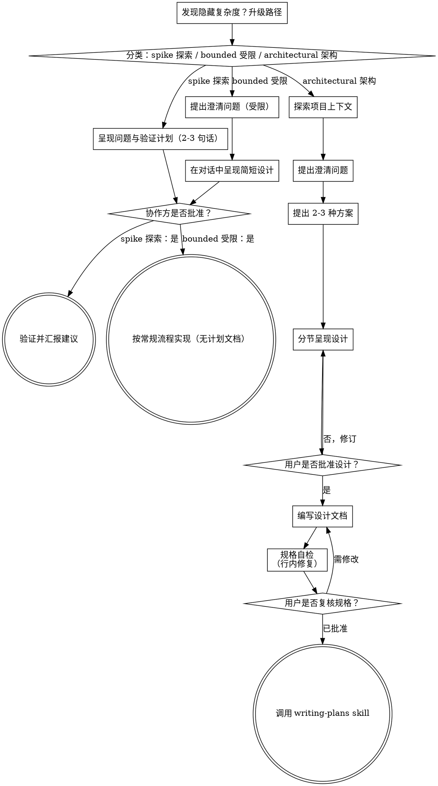

# 将想法头脑风暴为设计

通过自然的协作对话，将想法转化为完整、可落地的设计与规格说明。

首先判断本次请求需要多少流程，然后按对应路径推进：理解上下文、细化想法、呈现设计、并获得协作方的确认。

<HARD-GATE>
严禁在告知协作方你的意图并获得其批准之前，调用任何实现类 skill、编写任何代码、搭建任何项目或执行任何实现动作。该约束适用于下方所有路径中的所有任务——流程的繁简可随任务伸缩，审批关卡绝不放宽。
</HARD-GATE>

## 三条路径

在提出第一个问题前，先对请求进行分类并大声说出分类结果——例如“这看起来是受限任务，我会在对话中直接给出简短设计，而不是编写规格文档”——以便协作方及时纠正：

- **Spike 探索** — 可行性问题（“能否……”“是否可能……”“快速粗糙实现即可”），产出是答案，而非可保留的代码。用 2-3 句话说明问题及验证方式，获得认可后，以满足正确性前提下的最低成本去验证。无需设计文档与规格文件。以建议形式汇报发现，任何为验证而构建的代码均标注为“一次性/可丢弃”。
- **Bounded 受限** — 对本仓库已有代码的明确范围变更：新增开关、小型接口、单文件修复。仅了解应用类型是不够的——“受限”意味着你要改的流程已在仓库中可查可读。若没有可改的既有流程，则不属于受限任务。提出关键的澄清问题，在对话中直接呈现简短设计（几句话到几段短文），然后停止。仅在协作方对该设计明确说“同意”后方可开始实现——受限任务的审批与架构级任务一样严格。无需规格文件与实现计划文档。
- **Architectural 架构** — 新项目、新子系统，或会重塑组件间协作方式、改变他人依赖接口的变更。遵循完整流程：提问、提供方案、分节设计、编写规格文档，然后进入 writing-plans skill。

当在两条路径间犹豫时，选择更重的那一条。棘轮单向生效：任务中途发现隐藏复杂度即升级路径——立即停下、说明情况、提升等级。任务中途不允许降级。

## 反模式：“太简单，不需要审批”

每条路径都以“协作方在实现前批准你的意图”作为结束。待办清单、单函数工具、配置变更——设计或许只有对话中的两句话，但必须呈现并获得批准。“简单”任务恰恰最容易因未经审视的假设而造成返工。随简易程度伸缩的是产出物，而非审批环节。

## 红线信号

| 想法 | 实际情况 |
|---------|---------|
| “这太简单，不需要设计” | 简单意味着设计要短，而不是没有设计。在对话中用两句话说明，然后等待批准。 |
| “我把它算作受限任务，就可以跳过规格了” | 刻意找标签来省事，本身就是存疑的信号——选择更重的路径。 |
| “这是受限任务，设计很明显——我边写边让他们看就行” | 关卡在于“批准”，而非设计长短。先呈现，然后停下，直到听到明确的“同意”。 |
| “我了解这类应用，所以算是受限任务” | “受限”衡量的是仓库现状，而非你的熟悉程度。新项目没有既有流程——属于架构级。 |
| “探索验证跑通了，就把代码留下来吧” | 探索的产出是答案。保留代码属于新需求——需重新分类。 |
| “需求膨胀了，但快做完了——没必要重新分类” | 隐藏复杂度会中途升级路径。立即停下并说明。 |
| “他们已经批准了探索，后续改动也算批准了” | 每个任务都需独立分类与独立批准。 |

## 检查清单

先分类、宣告路径，然后为所在路径的每一项创建任务并按顺序完成。

**Spike 探索：**
1. **探索项目上下文** — 充分到足以界定验证问题
2. **呈现问题与验证计划** — 2-3 句话
3. **获得批准** — 点头认可即可
4. **开展验证** — 在保证正确性的前提下以最低成本进行
5. **汇报发现** — 给出建议；将所有为验证而构建的内容标注为一次性产物

**Bounded 受限：**
1. **探索项目上下文** — 检查文件、文档、近期提交
2. **提出澄清问题** — 逐个提出，只问关键问题
3. **在对话中呈现简短设计** — 方案、涉及文件、测试方式
4. **获得批准** — 停下并等待明确的“同意”；一边呈现设计一边就开始动手，等同于跳过关卡
5. **实现** — 按常规开发流程推进（适用 TDD）；无需计划文档

**Architectural 架构：**
1. **探索项目上下文** — 检查文件、文档、近期提交
2. **按需提供可视化协作** — 不要一开始就提供。仅当某个问题“看图比看文字更清楚”时，才在当时单独发一条消息提出；获准后为你打开浏览器标签页。若始终未出现需要可视化的问题，则全程不提。详见下文“可视化协作”一节。
3. **提出澄清问题** — 逐个提问，厘清目标、约束与成功标准
4. **提出 2-3 种方案** — 含权衡分析与你的推荐
5. **呈现设计** — 按复杂度分节呈现，每节后征求用户确认
6. **编写设计文档** — 保存至 `docs/superpowers/specs/YYYY-MM-DD-<topic>-design.md` 并提交
7. **规格自检** — 快速行内检查占位符、矛盾、歧义与范围（见下文）
8. **用户复核书面规格** — 请用户在继续前复核规格文件
9. **转入实现** — 调用 writing-plans skill 创建实现计划

## 流程图

**终态与路径绑定。** 架构路径：头脑风暴后唯一可调用的 skill 是 writing-plans——严禁调用 frontend-design、mcp-builder 或任何其他实现类 skill。受限路径：获批后直接按常规开发流程实现；无需计划文档。Spike 探索：终态为汇报建议。

## 详细流程

以下小节服务于受限与架构两条路径（探索路径在“呈现验证计划并获得认可”后即结束）。自 **探索方案** 起为架构路径的深度内容——对于受限任务，上下文探索加上几个问题再加对话中的简短设计即为全部流程。

**理解想法：**

- 首先查看当前项目状态（文件、文档、近期提交）
- 在深入提问前先评估范围：若需求描述了多个独立子系统（例如“构建一个包含聊天、文件存储、计费与数据分析的平台”），需立即指出。不要在需要先拆解的项目上浪费时间细化细节。
- 若项目过大不适合用单一规格承载，帮助用户拆解为子项目：有哪些独立部分、它们之间如何关联、应按何种顺序构建？然后按常规设计流程对首个子项目进行头脑风暴。每个子项目各自拥有独立的 规格 → 计划 → 实现 周期。
- 对于范围合适的项目，逐个提问以细化想法
- 尽可能使用选择题，但开放性问题也可以
- 每条消息只问一个问题——若某主题需深入探讨，拆成多个问题逐条提出
- 聚焦理解：目标、约束、成功标准

**探索方案：**

- 提出 2-3 种不同方案并说明权衡
- 以对话方式呈现选项，给出你的推荐及理由
- 优先呈现推荐方案并解释原因
- 严格遵循 YAGNI 原则——从每个方案与设计中剔除不必要的功能

**呈现设计：**

- 当你认为已理解要构建的内容后，呈现设计
- 按复杂度伸缩每节篇幅：简单处几句话即可，复杂处可写 200-300 字
- 每节结束后询问是否符合预期
- 覆盖：架构、组件、数据流、错误处理、测试
- 随时准备回头澄清不清晰之处

**为隔离性与清晰性而设计：**

- 将系统拆分为职责单一的小单元，各单元通过定义良好的接口通信，且可独立理解与测试
- 对每个单元，都应能回答：它是做什么的、如何使用、依赖什么？
- 能否不读内部实现就理解单元的用途？能否在不破坏调用方的情况下修改内部实现？若不能，说明边界需要调整。
- 小而边界清晰的单元也更便于你协作——你更容易一次性在上下文中理解代码，聚焦文件的编辑也更可靠。当文件变得过大时，往往意味着它承担了过多职责。

**在现有代码库中工作：**

- 提出变更前先探索现有结构，遵循既有模式。
- 若现有代码中存在影响当前工作的问题（例如文件过大、边界不清、职责纠缠），应在设计中包含针对性的改进——如同优秀开发者在工作区域内顺手改善代码。
- 不要提出与当前目标无关的重构。保持聚焦，只做服务于当前目标的事。

## 设计之后（架构路径）

**文档：**

- 将已验证的设计（规格）写入 `docs/superpowers/specs/YYYY-MM-DD-<topic>-design.md`
  - （若用户对规格存放位置有偏好，以其偏好为准）
- 如可用，使用 elements-of-style:writing-clearly-and-concisely skill 优化表达
- 将设计文档提交至 git

**规格自检：**
编写完规格文档后，以全新视角审视一遍：

1. **占位符扫描：** 是否存在 “TBD”、“TODO”、未完成章节或模糊需求？立即修复。
2. **内部一致性：** 各章节是否相互矛盾？架构是否与功能描述一致？
3. **范围检查：** 是否足够聚焦、适合单一实现计划承载，或需要进一步拆解？
4. **歧义检查：** 是否存在可被两种方式解读的需求？若有，选定一种并明确表述。

发现问题直接行内修复，无需再次复审——改完即继续。

**用户复核关卡：**
规格自检通过后，请用户在继续前复核书面规格：

> “规格已编写并提交至 `<path>`。请复核，如需变更请告知，确认后再进入实现计划的编写。”

等待用户回复。若用户提出修改，完成修改后重新执行规格自检循环。仅在用户批准后方可继续。

**实现：**

- 调用 writing-plans skill 创建详细的实现计划
- 不要调用任何其他 skill。下一步仅为 writing-plans。

## 可视化协作

基于浏览器的可视化协作工具，用于在头脑风暴期间展示原型、图表与可视化选项。这是一个工具，而非模式。接受协作意味着在适合可视化的问题上可使用它；并不意味着每个问题都要走浏览器。

**提供协作的时机（按需提供）：** 不要一开始就提供。仅当某个问题确实“看比说更清楚”——即真正涉及原型/布局/图表的问题，而不仅仅是聊到 UI 话题——才在首次出现时单独发一条消息提供：
> “接下来的部分或许看图会更清楚——我可以在浏览器标签页中为你实时准备原型、图表与对比方案。该功能仍较新且较耗 token。需要我打开吗？我会为你自动打开。”

**该提议必须单独成一条消息。** 仅包含提议——不要附带澄清问题、总结或其他内容。等待用户回复。若用户接受，以 `--open` 启动服务，使其浏览器自动打开首屏。若用户拒绝，则继续纯文本协作，除非用户主动提起，否则不再提议。

**逐题决策：** 即使用户已接受，仍需针对每个问题决定使用浏览器还是终端。判断标准：**用户看图是否比看文字更易理解？**

- **使用浏览器** 处理视觉内容——原型、线框、布局对比、架构图、并排视觉设计
- **使用终端** 处理文本内容——需求问题、概念抉择、权衡清单、A/B/C/D 文本选项、范围决策

涉及 UI 话题的问题不一定是视觉问题。“在此上下文中 personality 指什么？”是概念问题——使用终端。“哪种向导布局更合适？”是视觉问题——使用浏览器。

若用户同意使用协作，请在继续前阅读详细指南：
`skills/brainstorming/visual-companion.md`
