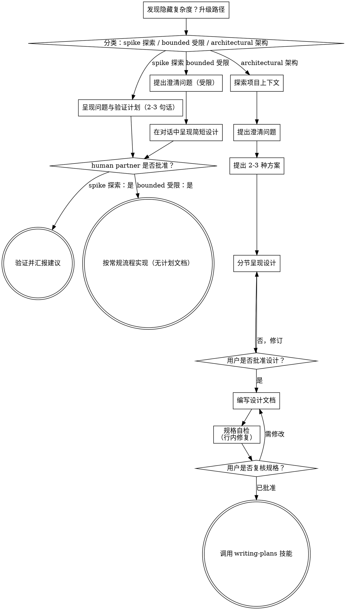

# 将想法头脑风暴为设计

帮助你把想法通过自然的协作对话，转化为完整成型的设计与规格说明。

先从判断本次请求需要多少流程开始，然后沿对应路径推进：理解上下文、细化想法、呈现设计，并获得 human partner 的批准。

## 建立共识

头脑风暴的产出是一种 human partner 能够识别并纠正的理解，且以他们想要达成的目标为基础。

1. **发掘意图。** 利用请求与可用上下文，确定预期成果、受众是谁、成功是什么样的。当这些信息缺失时，先提出一个聚焦于目的或用意的问题，再提议功能或方案。了解应用类型并不能告诉你 human partner 为什么想要它。补充缺失的需求并不意味着要求对方再次授权任务。
2. **把你的理解写回去。** 用一段简短说明总结预期成果、相关约束与成功标准，供 human partner 评估。把你听到的内容与你的假设区分开。邀请对方纠正，并在把这段话当作设计 brief 之前纳入他们的答复。
3. **把意图带进设计。** 在所选路径的设计产物中保留已确认的理解：架构级工作用书面规格，受限任务与 spike 用对话内设计/验证。对照该理解检查拟议的功能与技术选择。

当请求本身已经提供了目的与约束时，直接反映该理解，而不是重复提出同样的问题。说明保持简短；其准确性以及被纠正的机会才重要。

<HARD-GATE>
在采取任何实现动作之前——包括调用实现类 skill、编写产品代码、搭建脚手架、安装产品依赖或创建外部项目——必须先完成所选路径的前置条件：

- Spike：human partner 批准问题与验证计划。
- Bounded 受限：human partner 批准对话中的简短设计。
- Architectural 架构：human partner 复核并批准书面规格，然后复核书面实现计划并选择其执行方式。对话中的设计获批仅允许编写规格；书面规格获批仅允许调用 writing-plans。

一条回复批准的只是实际呈现的那个阶段。对想法或功能范围的批准，并不等于批准尚不存在的产物。从最早未完成的阶段继续；不要把一个批准当作跳过所选路径其余部分的许可。在这些前置条件尚未完成时，允许进行只读的项目探索。
</HARD-GATE>

## 三条路径

在提出第一个问题前，先对请求进行分类并大声说出分类结果——例如“这看起来是受限任务，我会在这里呈现简短设计，而不是编写规格”——以便 human partner 可以纠正你：

- **Spike 探索** — 可行性问题（“能否……”“是否可能……”“快速粗糙即可”），产出是答案，而非你要保留的代码。用 2-3 句话呈现问题与你要尝试的内容，获得点头认可，然后在满足正确性前提下的最低成本范围内去验证。无需设计文档与规格文件。以建议形式汇报发现；任何为验证而构建的内容都保持“一次性”标注。
- **Bounded 受限** — 对本仓库中已存在代码的明确范围变更：新增开关、小型接口、单文件修复。仅了解应用类型是不够的——受限意味着你要改的流程已经在这里、可以阅读。若没有可改的既有流程，则该任务不属于受限。提出那些真正重要的澄清问题，在对话中呈现简短设计（几句话到几段短文），然后停止。实现只会在 human partner 对该设计明确说“同意”之后开始——受限任务的审批与架构级任务一样是一道硬关卡。无需规格文件与实现计划文档。
- **Architectural 架构** — 新项目、新子系统，或会重塑组件之间如何组合、改变他人所依赖接口的变更。遵循完整流程：提问、方案、分节设计、书面规格，然后进入 writing-plans 技能。

当在两条路径之间犹豫时，选择更重的那一条。棘轮单向生效：任务中途发现的隐藏复杂度会升级路径——停下、说明情况、向上提升。任务中途没有任何东西可以降级。

## 反模式：“太简单，不需要审批”

每条路径都以 human partner 在实现前批准所需设计作为结束。受限变更可能只需要对话中的两句话。一个新的待办清单项目是架构级的，需要书面规格与规划交接。按所选路径缩放产物；在实现前完成该路径的全部复核。

## 红线信号

| 想法 | 实际情况 |
|---------|---------|
| “这太简单，不需要设计” | 遵循所选路径：受限变更得到对话中的简短设计；架构级变更得到书面规格与规划交接。 |
| “我把它算作受限任务，就可以跳过规格了” | 刻意找一个标签来跳过工作本身就是存疑——选择更重的路径。 |
| “这是受限任务，设计显而易见——他们读的时候我就开始” | 关卡在于批准，而非设计长度。先呈现，然后停下，直到听到明确的“同意”。 |
| “我了解这类应用，所以它是受限的” | 受限衡量的是仓库，而非你的熟悉程度。新项目没有既有流程——它是架构级的。 |
| “spike 跑通了，所以我把代码留下” | spike 的产出是答案。保留代码是新请求——对它分类。 |
| “它膨胀了，但我快做完了——没必要重新分类” | 隐藏复杂度会中途升级路径。停下并说明。 |
| “他们批准了 spike，所以后续变更也算批准了” | 每个任务都有自己的分类与自己的批准。 |

## 检查清单

先分类，宣告路径，然后为所在路径的每一项创建任务并按顺序完成。

**Spike 探索：**
1. **探索项目上下文** — 充分到足以界定验证问题
2. **呈现问题与验证计划** — 2-3 句话
3. **获得批准** — 点头认可即可
4. **开展验证** — 在保证正确性的前提下以最低成本进行
5. **汇报发现** — 给出建议；将所有为验证而构建的内容标注为一次性产物

**Bounded 受限：**
1. **探索项目上下文** — 检查文件、文档、近期提交
2. **提出澄清问题** — 逐个提出，只问关键问题
3. **在对话中呈现简短设计** — 方案、涉及文件、测试方式
4. **获得批准** — 停下并等待明确的“同意”；一边呈现设计一边就开始动手，等同于跳过关卡
5. **实现** — 按常规开发流程推进（适用 TDD）；无需计划文档

**Architectural 架构：**
1. **探索项目上下文** — 检查文件、文档、近期提交
2. **按需提供可视化协作** — 不要一开始就提供。仅当某个问题“看图比看文字更清楚”时，才在当时单独发一条消息提出；获准后为你打开浏览器标签页。若始终未出现需要可视化的问题，则全程不提。详见下文“可视化协作”一节。
3. **提出澄清问题** — 逐个提问，厘清目标、约束与成功标准
4. **提出 2-3 种方案** — 含权衡分析与你的推荐
5. **呈现设计** — 按复杂度分节呈现，每节后征求用户确认
6. **编写设计文档** — 保存至 `docs/superpowers/specs/YYYY-MM-DD-<topic>-design.md` 并提交
7. **规格自检** — 快速行内检查占位符、矛盾、歧义与范围（见下文）
8. **用户复核书面规格** — 请用户在继续前复核规格文件
9. **转入实现** — 调用 writing-plans 技能创建实现计划

## 流程图

```dot
digraph brainstorming {
    "分类：spike 探索 / bounded 受限 / architectural 架构" [shape=diamond];
    "呈现问题与验证计划（2-3 句话）" [shape=box];
    "提出澄清问题（受限）" [shape=box];
    "在对话中呈现简短设计" [shape=box];
    "human partner 是否批准？" [shape=diamond];
    "验证并汇报建议" [shape=doublecircle];
    "按常规流程实现（无计划文档）" [shape=doublecircle];
    "探索项目上下文" [shape=box];
    "提出澄清问题" [shape=box];
    "提出 2-3 种方案" [shape=box];
    "分节呈现设计" [shape=box];
    "用户是否批准设计？" [shape=diamond];
    "编写设计文档" [shape=box];
    "规格自检\n（行内修复）" [shape=box];
    "用户是否复核规格？" [shape=diamond];
    "调用 writing-plans 技能" [shape=doublecircle];
    "发现隐藏复杂度？升级路径" [shape=box];

    "分类：spike 探索 / bounded 受限 / architectural 架构" -> "呈现问题与验证计划（2-3 句话）" [label="spike 探索"];
    "分类：spike 探索 / bounded 受限 / architectural 架构" -> "提出澄清问题（受限）" [label="bounded 受限"];
    "分类：spike 探索 / bounded 受限 / architectural 架构" -> "探索项目上下文" [label="architectural 架构"];
    "呈现问题与验证计划（2-3 句话）" -> "human partner 是否批准？";
    "提出澄清问题（受限）" -> "在对话中呈现简短设计";
    "在对话中呈现简短设计" -> "human partner 是否批准？";
    "human partner 是否批准？" -> "验证并汇报建议" [label="spike 探索：是"];
    "human partner 是否批准？" -> "按常规流程实现（无计划文档）" [label="bounded 受限：是"];
    "发现隐藏复杂度？升级路径" -> "分类：spike 探索 / bounded 受限 / architectural 架构";
    "探索项目上下文" -> "提出澄清问题";
    "提出澄清问题" -> "提出 2-3 种方案";
    "提出 2-3 种方案" -> "分节呈现设计";
    "分节呈现设计" -> "用户是否批准设计？";
    "用户是否批准设计？" -> "分节呈现设计" [label="否，修订"];
    "用户是否批准设计？" -> "编写设计文档" [label="是"];
    "编写设计文档" -> "规格自检\n（行内修复）";
    "规格自检\n（行内修复）" -> "用户是否复核规格？";
    "用户是否复核规格？" -> "编写设计文档" [label="需修改"];
    "用户是否复核规格？" -> "调用 writing-plans 技能" [label="已批准"];
}
```

**终态与路径绑定。** 架构路径：头脑风暴后唯一可调用的 skill 是 writing-plans——严禁调用 frontend-design、mcp-builder 或任何其他实现类 skill。受限路径：获批后直接按常规开发流程实现；无需计划文档。Spike 探索：终态为汇报建议。

## 详细流程

以下小节服务于受限与架构两条路径（spike 在“呈现验证计划并获得认可”后即结束）。自 **探索方案** 起为架构路径的深度内容——对于受限任务，上下文加上几个问题再加上对话中的简短设计即为全部流程。

**理解想法：**

- 首先查看当前项目状态（文件、文档、近期提交）
- 在提出详细问题前先评估范围：若请求描述了多个独立子系统（例如“构建一个包含聊天、文件存储、计费与分析功能的平台”），需立即指出。不要在需要先拆解的项目上浪费提问来细化细节。
- 若项目过大不适合用单一规格承载，帮助用户拆解为子项目：有哪些独立部分、它们之间如何关联、应按何种顺序构建？然后按常规设计流程对首个子项目进行头脑风暴。每个子项目各自拥有独立的 规格 → 计划 → 实现 周期。
- 对于范围合适的项目，逐个提问以细化想法
- 尽可能使用选择题，但开放性问题也可以
- 每条消息只问一个问题——若某主题需深入探讨，拆成多个问题逐条提出
- 聚焦理解：目标、约束、成功标准

**探索方案：**

- 提出 2-3 种不同方案并说明权衡
- 以对话方式呈现选项，给出你的推荐及理由
- 优先呈现推荐方案并解释原因
- 严格遵循 YAGNI 原则——从每个方案与设计中剔除不必要的功能

**呈现设计：**

- 当你认为已理解要构建的内容后，呈现设计
- 按复杂度缩放每节篇幅：直截了当处几句话即可，微妙复杂处可写 200-300 字
- 每节结束后询问目前看起来是否合适
- 覆盖：架构、组件、数据流、错误处理、测试
- 随时准备回头澄清不清晰之处

**为隔离性与清晰性而设计：**

- 将系统拆分为职责单一的小单元，各单元通过定义良好的接口通信，且可独立理解与测试
- 对每个单元，都应能回答：它是做什么的、如何使用、依赖什么？
- 能否不读内部实现就理解单元的用途？能否在不破坏调用方的情况下修改内部实现？若不能，说明边界需要调整。
- 小而边界清晰的单元也更便于你协作——你更容易一次性在上下文中理解代码，聚焦文件的编辑也更可靠。当文件变得过大时，往往意味着它承担了过多职责。

**在现有代码库中工作：**

- 提出变更前先探索现有结构，遵循既有模式。
- 若现有代码中存在影响当前工作的问题（例如文件过大、边界不清、职责纠缠），应在设计中包含针对性的改进——如同优秀开发者在工作区域内顺手改善代码。
- 不要提出与当前目标无关的重构。保持聚焦，只做服务于当前目标的事。

## 设计之后（架构路径）

**文档：**

- 将已验证的设计（规格）写入 `docs/superpowers/specs/YYYY-MM-DD-<topic>-design.md`
  - （若用户对规格存放位置有偏好，以其偏好为准）
- 如可用，使用 elements-of-style:writing-clearly-and-concisely skill 优化表达
- 将设计文档提交至 git

**规格自检：**
编写完规格文档后，以全新视角审视一遍：

1. **占位符扫描：** 是否存在 “TBD”、“TODO”、未完成章节或模糊需求？立即修复。
2. **内部一致性：** 各章节是否相互矛盾？架构是否与功能描述一致？
3. **范围检查：** 是否足够聚焦、适合单一实现计划承载，或需要进一步拆解？
4. **歧义检查：** 是否存在可被两种方式解读的需求？若有，选定一种并明确表述。

发现问题直接行内修复，无需再次复审——改完即继续。

**用户复核关卡：**
规格自检通过后，请用户在继续前复核书面规格：

> “规格已编写并提交至 `<path>`。请复核，如需变更请告知，确认后再进入实现计划的编写。”

等待用户回复。若用户提出修改，完成修改后重新执行规格自检循环。仅在用户批准后方可继续。

**实现：**

- 调用 writing-plans 技能创建详细的实现计划
- 不要调用任何其他 skill。下一步仅为 writing-plans。

## 可视化协作

基于浏览器的协作工具，用于在头脑风暴期间展示原型、图表与可视化选项。这是一个工具，而非模式。接受协作意味着在适合可视化处理的问题上可使用它；并不意味着每个问题都要走浏览器。

**提供协作的时机（按需提供）：** 不要一开始就提供。等待某个问题确实“看图比看文字更清楚”——即真正涉及原型/布局/图表的问题，而不仅仅是聊到 UI 话题——才在首次出现时单独发一条消息提供：
> “接下来的部分或许看图会更清楚——我可以在浏览器标签页中为你实时准备原型、图表与对比方案。该功能仍较新且较耗 token。需要我打开吗？我会为你自动打开。”

**该提议必须单独成一条消息。** 仅包含提议——不要附带澄清问题、总结或其他内容。等待用户回复。若用户接受，以 `--open` 启动服务，使其浏览器自动打开首屏。若用户拒绝，则继续纯文本协作，除非用户主动提起，否则不再提议。

**逐题决策：** 即使用户已接受，仍需针对每个问题决定使用浏览器还是终端。判断标准：**用户看图是否比看文字更易理解？**

- **使用浏览器** 处理视觉内容——原型、线框、布局对比、架构图、并排视觉设计
- **使用终端** 处理文本内容——需求问题、概念抉择、权衡清单、A/B/C/D 文本选项、范围决策

涉及 UI 话题的问题不一定是视觉问题。“在此上下文中 personality 指什么？”是概念问题——使用终端。“哪种向导布局更合适？”是视觉问题——使用浏览器。

若用户同意使用协作，请在继续前阅读详细指南：
`skills/brainstorming/visual-companion.md`
