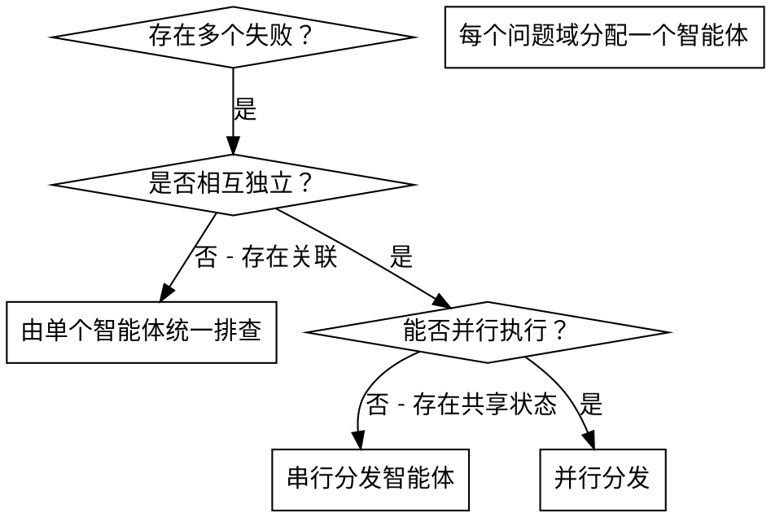

# 并行分发智能体

## 概述

你将任务委派给拥有隔离上下文的专用智能体。通过精确构造指令与上下文，确保它们保持专注并成功完成任务。它们不应继承你当前会话的上下文或历史——你需要按需精确构造所需信息。这也能保留你自身的上下文，用于统筹协调工作。

当存在多个互不相关的失败时（不同的测试文件、不同的子系统、不同的缺陷），串行排查会浪费大量时间。每一项排查都是独立的，可以并行进行。

**核心原则：** 每个独立的问题域分派一个智能体，让它们并发执行。

## 何时使用



**适用场景：**
- 3 个以上测试文件失败，且根因各不相同
- 多个子系统各自独立出现故障
- 每个问题无需依赖其他问题的上下文即可理解
- 各排查过程之间不存在共享状态

**不适用场景：**
- 失败之间存在关联（修复一个可能顺带修复其他）
- 需要理解完整的系统状态
- 智能体之间会相互干扰

## 使用模式

### 1. 识别独立的问题域

按故障点对失败进行分组：
- 文件 A 测试：工具审批流程
- 文件 B 测试：批量完成行为
- 文件 C 测试：中止功能

每个领域都是独立的——修复工具审批不会影响中止相关的测试。

### 2. 创建聚焦的智能体任务

每个智能体应获得：
- **明确范围：** 单个测试文件或子系统
- **清晰目标：** 让这些测试通过
- **约束条件：** 不得改动其他代码
- **预期输出：** 发现了什么、修复了什么的总结

### 3. 并行分发

在同一条回复中一次性发起全部三个子智能体分发——它们将并行运行：

```text
Subagent (general-purpose): "Fix agent-tool-abort.test.ts failures"
Subagent (general-purpose): "Fix batch-completion-behavior.test.ts failures"
Subagent (general-purpose): "Fix tool-approval-race-conditions.test.ts failures"
# All three run concurrently.
```

在同一条回复中发起多次分发调用 = 并行执行。每条回复只发一次 = 串行执行。

### 4. 复核与集成

当智能体返回后：
- 阅读每一份总结
- 验证各修复之间是否存在冲突
- 运行完整测试套件
- 整合所有变更

## 智能体提示词结构

优秀的智能体提示词应具备：
1. **聚焦** - 一个清晰的问题域
2. **自包含** - 包含理解问题所需的全部上下文
3. **输出明确** - 智能体应该返回什么？

```markdown
Fix the 3 failing tests in src/agents/agent-tool-abort.test.ts:

1. "should abort tool with partial output capture" - expects 'interrupted at' in message
2. "should handle mixed completed and aborted tools" - fast tool aborted instead of completed
3. "should properly track pendingToolCount" - expects 3 results but gets 0

These are timing/race condition issues. Your task:

1. Read the test file and understand what each test verifies
2. Identify root cause - timing issues or actual bugs?
3. Fix by:
   - Replacing arbitrary timeouts with event-based waiting
   - Fixing bugs in abort implementation if found
   - Adjusting test expectations if testing changed behavior

Do NOT just increase timeouts - find the real issue.

Return: Summary of what you found and what you fixed.
```

## 常见错误

**❌ 范围过大：** "修复所有测试" - 智能体容易迷失方向
**✅ 具体明确：** "修复 agent-tool-abort.test.ts" - 范围聚焦

**❌ 缺乏上下文：** "修复竞态条件" - 智能体不知道位置
**✅ 提供上下文：** 粘贴错误信息和测试名称

**❌ 缺少约束：** 智能体可能会重构所有内容
**✅ 明确约束：** "不要改动生产代码" 或 "仅修复测试"

**❌ 输出模糊：** "修好它" - 你无法知道改了什么
**✅ 输出具体：** "返回根因与变更总结"

## 何时不应使用

**存在关联的失败：** 修复一个可能顺带修复其他——应先一起排查
**需要完整上下文：** 理解问题需要看到整个系统
**探索式调试：** 尚不清楚哪里出了问题
**存在共享状态：** 智能体会相互干扰（编辑同一文件、占用同一资源）

## 来自真实会话的示例

**场景：** 大规模重构后，3 个文件共出现 6 个测试失败

**失败情况：**
- agent-tool-abort.test.ts：3 个失败（时序问题）
- batch-completion-behavior.test.ts：2 个失败（工具未执行）
- tool-approval-race-conditions.test.ts：1 个失败（执行次数为 0）

**决策：** 属于独立领域——中止逻辑、批量完成、竞态条件三者相互分离

**分发：**
```
Agent 1 → Fix agent-tool-abort.test.ts
Agent 2 → Fix batch-completion-behavior.test.ts
Agent 3 → Fix tool-approval-race-conditions.test.ts
```

**结果：**
- Agent 1：用基于事件的等待替代了固定超时
- Agent 2：修复了事件结构缺陷（threadId 位置错误）
- Agent 3：增加了对异步工具执行完成的等待

**集成：** 所有修复相互独立，无冲突，全量测试通过

## 验证

智能体返回后：
1. **复核每份总结** - 理解变更内容
2. **检查是否存在冲突** - 智能体是否编辑了同一段代码？
3. **运行全量测试** - 验证所有修复协同工作正常
4. **抽样检查** - 智能体可能存在系统性错误
