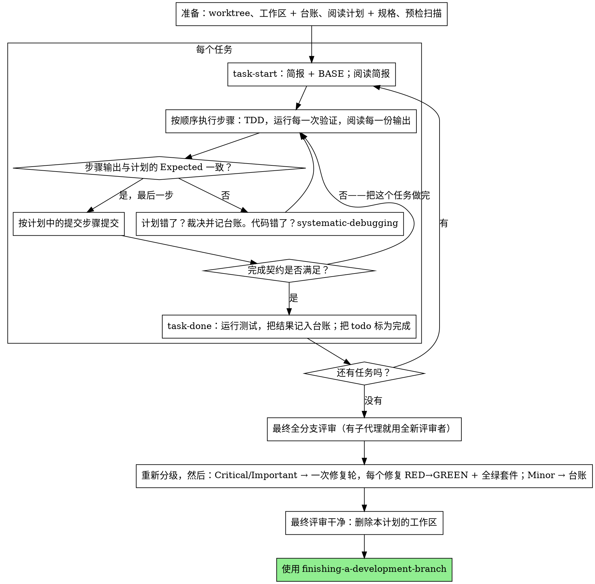

# 执行计划

在本会话中由你亲手逐任务执行计划：不为每个任务配实现者子代理，也不为每个任务配评审者。最后对整个分支做一次全新上下文的评审。

**为什么内联：** 子代理驱动开发要为每个任务各付一份全新实现者与一份全新评审者，两者都要从零重读代码库。内联执行只付一份上下文（你的），外加结束时的一位评审者。它放弃的，是每个任务一份全新上下文、以及每个任务的第二双眼睛。本技能用别的手段保住这两样东西买来的价值：简报就是规格，台账就是你的记忆，TDD 是每个任务的门禁，最终评审者就是那第二双眼睛。

**核心原则：** 思考已经由计划完成。严格照它执行，用你亲眼看着先失败、再通过的测试证明每一步，并留下能扛住你自己遗忘的记录。

**叙述：** 工具调用之间最多说一句短话——记录由台账和工具结果承载。

**连续执行：** 任务之间不要停下来跟伙伴确认。他们选择内联是为了少花钱，而不是为了在每个任务之后回答“要不要继续？”。把计划里的任务一口气全部执行完。

**裁决，而非停滞。** 冲突、含糊、计划缺陷——都由你裁决。规格是有约束力的权威，计划是它给出的论证，二者都答不上的部分由你的判断了结。每条决定都记入台账：`Ruling: <你决定了什么> — <为什么> — <错了要付出什么代价>`，然后继续。偏离计划却没有台账里的一条裁决，等于偷偷做了决定。

只有四件事会让你停下，也仅此四件：不可逆或破坏性操作；安全敏感的动作；按惯例应先打招呼的工作区外副作用（合并、推送到共享分支、发布）；以及烂到每条前路都只能靠猜的计划。遇到这些，停下并询问。

## 何时使用

- 你手上有来自 writing-plans 的计划，且伙伴在交接时选择了内联执行。
- 你的运行环境没有子代理工具（见 `../using-superpowers/references/` 中的各平台参考）。绝不要捏造一次分发；就在本地跑这份计划。
- 任务大体相互独立——与 subagent-driven-development 相同的前置条件。

一份完全写明的计划，让内联执行退化为“转写加测试”：它在中档会话模型上跑得很好，而最强模型真正值回票价的地方是最终评审，本技能会单独派发那一次评审。伙伴选择内联时，请这样告诉他们。

当伙伴要求每个任务都有评审关卡，或计划长到后半段任务会在被压缩的上下文里执行时，优先用 subagent-driven-development。长计划上的内联执行依然可行——台账正是它可恢复的原因——但最后几个任务得到的是你最少的注意力。

## 流程



## 准备

确保工作在隔离的工作区中进行：用 using-git-worktrees 创建一个，或核实已存在的那个。未经伙伴明确同意，绝不在 main/master 分支上开始实现。

对话记忆扛不过压缩。丢掉进度的内联执行者会重新实现那些提交已经存在的任务——与控制器重新派发它们是同一种失败，只不过代价记在你自己的上下文上。用台账文件跟踪进度，而不是只靠 todo。harness 的 todo 是实时视图；台账才是记录。

工作区与台账与 subagent-driven-development 共用——同一个目录、同一种格式——所以一份计划可以在执行中途换执行者，新执行者从同一份台账接着往下做。

- 每份计划拥有一个工作区：技能开始时运行 `../subagent-driven-development/scripts/sdd-workspace PLAN_FILE`——它会打印本计划的 git 忽略目录（`<repo-root>/.superpowers/sdd/<plan-basename>/`），该目录是这份计划所有产物的家：台账、简报、评审包。别的计划的目录永远不归你读写。
- 在本计划的 `<workspace>/progress.md` 检查台账。如果它的第一行点名的是你的计划文件，那么带 `Task <N>: complete` 行的任务就是已完成的——不要重做；从第一个没有该行的任务继续。即使你的上下文已不记得做过，它们的提交也确实存在于 git 中：压缩之后，宁可相信台账与 `git log`，也不要相信自己的回忆。第一行点名了另一份计划文件的台账，是别的计划的进度：别动它，另起一份全新的。
- 创建台账，第一行写身份：`# SDD ledger — plan: <plan file path>`。
- `git clean -fdx` 会摧毁工作区（它是 git 忽略的临时区）；真要发生，从 `git log` 恢复。

把计划读一遍，记下它的上下文与全局约束，并为每个任务建一条 todo。如果计划点名了规格，也要读它：规格是计划据以论证的权威，计划内部的冲突按规格裁决。读不到规格的计划，要在台账里记一条说明——没有规格时做出的裁决都是暂定的。

**必需子技能：** 现在、在任务 1 之前，加载 test-driven-development。它管着下面每个任务的每一步；一份步骤里已经写着“先写失败的测试”的计划，并不免除你去读它。

在任务 1 之前，扫描计划中任务之间的冲突。计划里的 Interfaces 块告诉你该往哪儿看：对每个消费早期任务产出的任务，记一行台账——涉及哪两个任务、一个产出什么而另一个消费什么、你发现了什么。彼此不共享任何东西的任务不必记行；任务之间毫无共享的计划，只写一行 `Pre-flight: no shared interfaces`。每个被台账行暴露出的冲突，都以规格为有约束力的权威做裁决，把裁决记在那一行旁边，然后开始任务 1。每个任务自身的文本在你读它的简报时才检查，不在这里检查。

## 任务循环

你打印的一切、每一条工具结果，都会在本次会话余下的时间里驻留在你的上下文中。把冗长的测试输出重定向到工作区里的文件，只读它的尾部；读简报，而不是读整份计划。

### 1. 接手任务

- 运行本技能的 `scripts/task-start PLAN_FILE N`。它在一次调用中打印简报路径与 BASE（该任务评审区间的起点提交）。每个任务都要读简报，包括你在准备阶段记得的那些：你记得的是摘要，简报里才是精确的取值、签名与测试用例。
- 把该任务的 todo 标为 in_progress。

每一次工具调用都是一轮重新读取你全部上下文的过程。记账要搭着干活一起走——追加台账与提交放在同一次调用里，绝不单独花一次调用。

### 2. 执行步骤

计划里的步骤已经按 RED-GREEN 排好序；在准备阶段加载的 test-driven-development 之下，按这个顺序执行。测试步骤的代码先写、先跑。看着它失败是一个步骤，不是走过场——一个在实现尚不存在时就通过的测试，是关于这个测试的一条发现。

每个要运行命令的步骤都有 `Expected:` 行。运行该命令，读它的输出，做比较。三种结果：

- **一致。** 进入下一步。
- **代码错了。** 使用 systematic-debugging。找到原因；绝不为了迎合步骤的输出去修补症状。
- **计划错了**——某个步骤与规格矛盾，早期任务的接口与本任务消费的内容对不上，某条命令根本不可能工作。就满足规格的最小改动做出裁决，记入台账 `Task <N>: Ruling: <发现> — <你决定了什么以及为什么>`，然后继续。裁决是被携带下去的，不是靠记住的：后来触碰同一接口的任务从台账里读到它。

按计划中的提交步骤提交。一个任务跨多次提交没关系；评审区间从 BASE 切起，永远不是 `HEAD~1`。

### 3. 完成契约

在一个任务的台账行写下之前，以下各项都成立，且证据来自本次会话——而不是从 diff 看起来没问题推断出来：

- 简报点名的每一个测试都存在，都在本任务中运行过，而且你读过输出。
- 该任务最后一次测试运行通过——`task-done` 就是那次运行，它把命令与结果写进台账行。
- 简报里的每一行 `Expected:` 都对照过真实输出。
- 每一处对简报的偏离，台账里都有对应的 `Ruling:` 行。

**必需子技能：** verification-before-completion 管辖这次断言。任何一项缺失，任务就没完成：把它做完。

### 4. 完成任务

运行本技能的 `scripts/task-done PLAN_FILE N BASE -- <测试命令>`，测试命令用简报为整个任务点名的那条。它会运行测试，把完整输出留在工作区，打印尾部，并且——只在测试通过时——把完成行追加到台账：

`Task <N>: complete (commits <base7>..<head7>, tests: <command> → <result>)`

失败的运行什么都不记录；任务没有完成。记录成功时，把 todo 标为完成，接手下一个任务。

## 最终评审

运行 `../subagent-driven-development/scripts/review-package PLAN_FILE MERGE_BASE HEAD`（MERGE_BASE = 分支起点的提交，例如 `git merge-base main HEAD`），并从它打印出的文件出发评审。

**有子代理工具时：** 用可用的最强模型派发评审者——全分支评审是一项判断题——使用 requesting-code-review 的 [code-reviewer.md](../requesting-code-review/code-reviewer.md)，并把包路径、计划与规格路径、计划的 Review Focus 段（若存在）逐字交给它（该段列出计划的测试未覆盖的输入类别与失败模式——评审者要逐条刻意检查），再加一个指向台账中 `Ruling:` 行的提示，让它能权衡你所做的决定。明确指定模型；省略模型会继承本会话的模型，而它未必是最强的。这是整轮执行唯一买到的一份全新上下文。不要跳过它，也不要用你自己读 diff 来代替它。

**没有子代理工具时：** 读 code-reviewer.md，在最后一个任务的台账行之后，作为单独的一遍，自己对该包执行那次评审。把 `Final review: self-review (no subagent tool)` 写进台账，并在最终消息里说明这一点：作者自评比一位全新评审者更弱，是否足够要在合并前由你的伙伴定夺。

在对任何发现动手之前，先给它们排序。评审者给的严重度标签是建议；门禁在你手里。它的“拒绝评判”清单也归你：那上面的每一行都是你要做出并记入台账的裁决，和计划冲突完全一样——`Final: Ruling: <评审者搁置的行为> — <使用该软件的理性之人会得到什么，以及为什么这站得住、或为什么它现在算一条发现> — <错了要付出什么代价>`。先按影响重新分级：规格是愿景文档，一条发现的等级取决于它若上线，使用该软件的理性之人会遭遇什么，而不是规格有没有点名触发它的输入——一位评审者仅仅因为规格沉默就把发现定为 Minor，那他评的是规格，不是影响。然后：

- **Critical 与 Important** 进入修复轮。
- **Minor** 作为 `Final: minor (deferred): <一句话>` 进台账，并进入最终消息的“延后的 Minor”一栏。Minor 绝不进入修复轮，也绝不变成裁决——裁决是对冲突的决定，不是你婉拒一条润色建议的备注。

Critical 与 Important 的发现由你自己修——这里你就是实现者——只修一轮。每个修复由 TDD 验证，而不是由第二位评审者验证：写出复现该发现的测试，看着它失败，让它通过，再跑整套测试。每条都记入台账 `Final: fixed <finding> — <test name> RED→GREEN, suite <N>/<N>`。没有先失败过的测试伴随的修复不算已验证；这一轮之后套件不绿，说明这一轮没结束。不要再派发复审：那只会重读一份 diff，而它对应的覆盖测试已经回答了“是否已解决”，套件运行已经回答了“有没有弄坏别的”。

你决定不修的发现是一条裁决——`Final: Ruling: <finding> — <代码为何站得住> — <错了要付出什么代价>`——并会出现在交给伙伴的裁决清单里。没有第二次修复轮。

## 收尾

删除任何东西之前，把台账中所有含 `Ruling:` 的行按你做出决定的顺序收集进最终消息的“我做出的裁决”一栏，每条带上错了要付出什么代价；再把所有 `minor (deferred)` 行收集进“延后的 Minor”一栏。两份清单都要穷尽。最终消息是你替伙伴所做的决定、以及你选择不处理的发现，唯一能到达他们那里的地方。

当最终评审干净、其修复也已提交，删除本计划的工作区目录——此后 git 历史就是记录。同级的其他目录属于别的计划，别碰。

使用 finishing-a-development-branch。

## 常见的自我合理化

| 借口 | 现实 |
|--------|---------|
| “我记得任务 N 说的是什么” | 你记得的是摘要。简报里才有精确的取值。去读它。 |
| “计划里的代码是对的，跳过看测试失败吧” | 你没见它失败过的测试什么都证明不了。那只是一个步骤。去跑它。 |
| “我到最后跑整套测试，不用每步都跑” | 每步都跑才能知道是哪一步弄坏的。任务结束时的运行是契约，不是替代品。 |
| “计划这里写错了，我直接做对的事就行” | 做对的事，并把裁决记进台账。不记台账的偏离就是偷偷做的决定。 |
| “台账行等做完几个任务再补” | 压缩不会等你方便的时候。每个任务一行，和提交放在同一条消息里。 |
| “下一个任务之前让我先确认一下” | 他们选择内联就是为了少花钱。进度确认花的是他们的时间。只有那四件事能让你停下。 |
| “我仔细读过自己的 diff 了，最终评审是多余的” | 同一个作者，同一片盲区。评审者是这一轮唯一买到的新鲜上下文。 |
| “测试应该能过，改动很琐碎” | “应该”不是证据。契约要求命令本身和它的输出。 |
| “子代理又慢又贵，最终评审我也一起省了” | 内联已经取消了每任务的评审者。对整个分支做一次评审是下限，不是上限。 |
| “评审者说是 Minor，那就是 Minor” | 那个标签评的是规格的沉默。要评人实际得到什么。先重新分级，再过门禁。 |
| “修复显而易见，不用先写失败的测试” | 失败的测试是唯一证明“发现是真的、且现在已消失”的东西。没有它，你只有一份 diff 和一点希望。 |
| “既然都动手了，把 Minor 一起修了吧” | 你修的每个 Minor 都是一个测试、一次修复、一轮套件运行，而伙伴并没有要求。记进台账；让伙伴决定。 |

## 示例工作流

```
你：我正在使用 executing-plans 技能内联实现这份计划。

[准备：worktree 已核实]
[读一遍计划：docs/superpowers/plans/feature-plan.md；规格已读]
[确定工作区：sdd-workspace docs/superpowers/plans/feature-plan.md — 里面没有台账，全新开始]
[预检扫描：2 行共享接口，4 行自洽性检查，无冲突；写入台账]
[为所有任务创建 todo]

任务 1：钩子安装脚本

[task-start plan 1 → 简报已读；BASE a1b2c3d]
[步骤 1：编写失败测试——已写]
[步骤 2：运行它——FAIL：install_hook 未定义。与 Expected 一致。]
[步骤 3：实现——已写]
[步骤 4：运行它——PASS 1/1。与 Expected 一致。]
[步骤 5：提交——d4e5f6a]
[契约：测试已运行，输出已读，无偏离]
[task-done plan 1 a1b2c3d -- npm test -- hooks → 台账：Task 1: complete (commits a1b2c3d..d4e5f6a, tests: npm test -- hooks → 1/1 pass)]

任务 2：恢复模式

[task-start plan 2 → 简报已读；BASE d4e5f6a]
[步骤 2：运行失败测试——FAIL，但报的是导入错误：任务 1 导出的是
 installHook，而简报消费的是 install_hook]
[Ruling: 简报的消费方名称相对任务 1 的 Produces 块是笔误；
 改用 installHook —— 台账：Task 2: Ruling: install_hook → installHook — 与任务 1 Produces 一致 — 错了要付出什么代价：一次重命名]
[步骤 2-5 按计划执行；提交 b7c8d9e]
[task-done plan 2 d4e5f6a -- npm test -- recovery → 台账：Task 2: complete (commits d4e5f6a..b7c8d9e, tests: npm test -- recovery → 8/8 pass)]

...

[所有任务完成后：review-package plan MERGE_BASE HEAD；派发 code-reviewer，用最强模型]
评审者：一条 Important 发现——进度上报间隔被硬编码。两条 Minor。
[重新分级：Important 成立；Minor → 作为延后项记入台账]
[修复轮：test_progress_interval_configurable RED → 抽出 PROGRESS_INTERVAL → GREEN；套件 12/12；提交]
[台账：Final: fixed hardcoded interval — test_progress_interval_configurable RED→GREEN, suite 12/12]

我做出的裁决：
- Task 2: install_hook → installHook（简报笔误；错了要付出什么代价：一次重命名）

延后的 Minor：
- README 缺少使用示例
- recovery.js 可以把 verify/repair 拆成两个文件

[删除本计划的工作区——记录如今存在 git 里]

正在使用 finishing-a-development-branch。
```
