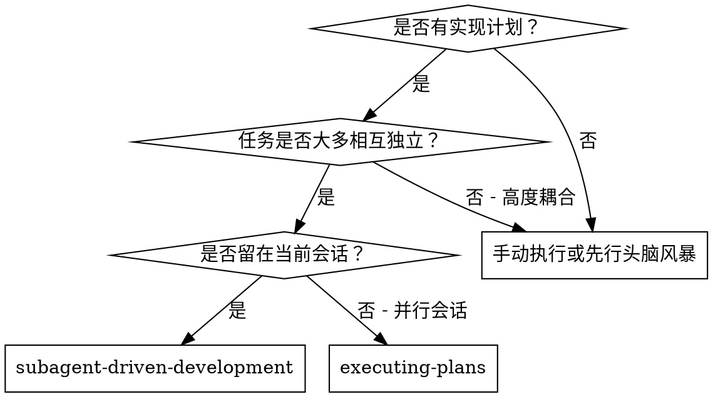
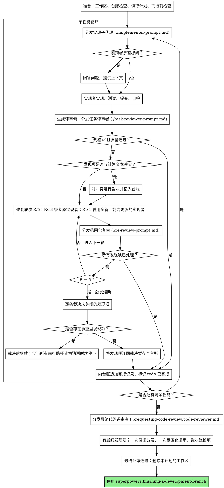

# 子代理驱动开发

按任务分发全新实现子代理、每任务后进行任务评审（规格符合度 + 代码质量）、最后进行全分支广度评审来执行计划。

**为什么使用子代理：** 你将任务委托给拥有隔离上下文的专用代理。通过精确构造指令与上下文，确保其保持专注并顺利完成任务。它们不应继承你的会话上下文或历史——你只需构造其所需的一切。这也能保留你自己的上下文用于统筹协调。

**核心原则：** 每任务全新子代理 + 任务评审（规格 + 质量）+ 最终广度评审 = 高质量、快迭代

**叙述：** 工具调用之间至多用一行简短语句叙述——台账与工具结果负责承载记录。

**持续执行：** 任务之间不要停下来向人类伙伴确认。一次性不间断执行计划中的所有任务。仅在以下四种情况或全部任务完成时才停下。“是否继续？”之类的确认与进度总结只会浪费对方时间——对方已要求你执行计划，那就执行到底。

**做裁决，不停摆。** 运行中的计划不等待人类。冲突、歧义、计划缺陷、你本想申请突破的上限——自行裁决。规格是约束性依据，计划是对规格的论证，你的判断填补二者未覆盖之处。将每个决策以 `Ruling: <裁决内容> — <原因> — <若错的代价>` 记录到台账，然后继续。错误的裁决只会带来可见、可撤销的返工；而卡在问题上停摆的会话会耗掉对方一整天且毫无收益。

仅以下四件事能让你停下，且只有这四件：不可逆或破坏性操作；安全敏感操作；超出本工作区、按惯例需先征询的副作用（如合并、推送到共享分支、发布）；以及计划破损到每条前行路径都只能靠猜。对于这些，停下来提问。

## 何时使用



**对比 Executing Plans（并行会话）：**
- 同一会话（无上下文切换）
- 每任务全新子代理（无上下文污染）
- 每任务后评审（规格符合度 + 代码质量），最后进行广度评审
- 更快迭代（任务间无需人类介入）

## 流程



## 准备工作

确保工作在隔离的工作区中进行：使用 superpowers:using-git-worktrees 创建或校验现有工作区。未经人类伙伴明确同意，绝不在 main/master 分支上开始实现。

对话记忆在压缩后不会保留。在真实会话中，丢失进度的控制器曾重新分发整串已完成任务——这是目前观察到代价最高的失败。请在台账文件中跟踪进度，而不仅依赖 todos。

- 每个计划拥有独立工作区：在技能启动时，运行本技能的 `scripts/sdd-workspace PLAN_FILE`——它会打印该计划的 git 忽略目录（`<repo-root>/.superpowers/sdd/<plan-basename>/`），该目录是本计划所有产物（台账、简报、报告、评审包）的归属地。切勿读写其他计划的目录。
- 在 `<workspace>/progress.md` 检查本计划的台账。若其首行写明了你的计划文件，则带有 `Task <N>: complete` 的任务视为已完成——不要重新分发；从首个未完成的任务继续。若任务最后一行是修复轮次，则该任务处于循环中：从下一轮继续循环。若台账首行指向另一计划文件——或在旧的扁平路径 `.superpowers/sdd/progress.md` 下发现游离台账——则视为他 plan 的进度：保持原位，为当前计划新建一份台账。
- 以标识作为首行创建台账：`# SDD ledger — plan: <plan file path>`。
- 台账是你的恢复地图：其中记录的提交在 git 中真实存在，即使你的上下文已不再记得曾创建过它们。压缩之后，请信任台账与 `git log`，而非你自己的记忆。
- `git clean -fdx` 会销毁工作区（它是被 git 忽略的临时区）；若发生，请从 `git log` 恢复。

通读一次计划，记下其上下文与全局约束，并为每个任务创建 todo。若计划中指明了规格，也一并阅读：规格是计划所论证的权威依据，计划内部的冲突应以规格为准进行裁决。无法找到规格的计划需在台账中注明——在此情况下做出的裁决均为临时性。

在分发任务 1 之前，对计划做一次冲突扫描，并边检查边记录检查内容：

- 相互矛盾或与计划全局约束冲突的任务
- 计划明确要求、但按评审标准视为缺陷的内容（例如断言为空的测试、逻辑块的逐字重复）

扫描输出是表格，而非结论。对每一对共享文件或接口的任务各列一行：两个任务、其一产出与另一消费内容的对照、以及你的发现。对每个任务各列一行：其自身文本是否自洽——所规定的测试与所规定的代码是否一致、所创建的文件与后续触及的文件是否一致。没有这些行的“扫描通过”不算完成扫描。

将表格写入台账。在执行开始前对所有发现项进行裁决——每项裁决均对照要求它的计划文本——并将每条裁决记录到台账。若扫描干净，则无需多言直接继续。对扫描中暴露的每个冲突进行裁决——规格为约束性依据，计划是其论证——将裁决记录在对应行旁，然后分发任务 1。评审循环仍是兜底机制，用于捕获仅在实现中才显现的冲突。

## 模型选择

为每个角色选用能胜任的最弱模型，以节省成本并提升速度。

**机械性实现任务**（孤立函数、清晰规格、1-2 个文件）：使用快速、廉价的模型。计划描述充分时，大多数实现任务都属于机械性任务。

**集成与判断类任务**（多文件协同、模式匹配、调试）：使用标准模型。

**架构与设计任务**：使用当前可用能力最强的模型。最终全分支评审即属此类——请在最强模型上分发，而非使用会话默认模型。

**评审任务**：根据差异的大小、复杂度与风险选择具有相应判断力的模型。小而机械的差异不需要最强模型；微妙的并发改动则需要。对小范围修复差异的范围化复审，选用廉价至中等层级即可。

**修复循环升级（第 4-5 轮）**：使用至少比卡住的实现者高一个层级的模型。

**分发子代理时务必显式指定模型。** 省略模型会继承你会话的模型——通常是最强也最昂贵的模型——这会无声地破坏本节的约束。

**轮次数量胜过 token 单价。** 墙钟耗时与上下文成本随子代理轮次数量线性增长，而最廉价的模型在多步任务上常需 2-3 倍轮次——总体成本反而更高。对评审者，以及基于自然语言描述工作的实现者，请以中等层级作为下限。当任务的计划文本已包含待编写的完整代码时，实现只是转录加测试：该实现者使用最廉价层级。单文件机械性修复同样使用最廉价层级。

**任务复杂度信号（实现任务）：**
- 涉及 1-2 个文件且规格完整 → 廉价模型
- 涉及多文件且有集成关注点 → 标准模型
- 需要设计判断或对代码库的广泛理解 → 最强模型

## 任务循环

**批量处理小型同构工作。** 当计划列出多个同类的小而独立的编辑——同一种单行修复、常量变更或跨文件重复的字段添加——不要为每项任务各分发一个子代理。将所有文件及其变更汇总到一份分发简报中，批量交给单个子代理，并将差异作为一个整体进行评审。只有需要独立判断、独立测试或独立评审面的工作，才保留一任务一分发。

你粘贴到分发提示中的一切——以及子代理返回的一切——都会在会话剩余时间内常驻上下文，并在后续每一轮被重新读取。请以文件形式移交产物。

**等待已分发的子代理时：** 切勿以短超时轮询等待接口，也不要陷入无声的无限等待。当你有本地工作可做时——更新台账、打包下一份评审、阅读报告——持续推进；子代结果会自行到达。当你真正空闲时，以有界时长等待（平台允许时每次 5 至 10 分钟），并在每段间隔发布一行状态、核对存活的子代：列出它们，并追查任何已完成却未上报的子代。有界等待几乎保留了长等待的全部效率，同时保证卡住或丢失的子代能在数分钟内被发现，而非等到会话结束。

### 1. 分发实现者

在分发前记录基线 BASE（`git rev-parse HEAD`）——评审包与修复轮次的差异需要它。

- **任务简报：** 分发实现者前，运行本技能的 `scripts/task-brief PLAN_FILE N`——它会将任务完整文本提取到唯一命名的文件并打印路径。按以下方式组织分发：让简报保持为需求的单一来源。你的分发应包含：(1) 一行说明本任务在项目中的位置；(2) 简报路径，并说明“先读此文件——它是你的需求，内有需逐字使用的精确取值”；(3) 简报无法获知的、来自先前任务的接口与决策；(4) 你在简报中发现的任何歧义的消解；(5) 报告文件路径与报告契约。精确取值（数值、魔法字符串、签名、测试用例）仅出现在简报中。切勿让子代理阅读整份计划文件。
- **报告文件：** 以简报命名实现者的报告文件（简报 `…/task-N-brief.md` → 报告 `…/task-N-report.md`），并写入分发提示。实现者在该文件中撰写完整报告，仅返回状态、提交记录、一行测试摘要与顾虑说明。
- 分发提示只描述一项任务，而非会话历史。不要将累积的先前任务摘要（“任务 1-3 之后的状态”）粘贴到后续分发中——真实会话中曾出现分发达 42k 字符、其中 99% 为粘贴历史的情况。全新子代理只需要其任务、所触及的接口与全局约束，不需要其他。
- 分发中携带无子代理契约（已在实现者模板中）：实现者绝不分发子代理——既不派生助手，也绝不派生评审者。评审由你在报告之后分发。在真实会话中，工作者自行派生的每个评审者都与控制器分发的任务评审重复——相当于每任务多出一席评审。
- 若先前任务在当前任务触及的区域暂存了发现项，请在分发中携带指向该台账条目的指针。
- 从分发结果中记录实现者的代理身份——修复循环第 1-3 轮将恢复该代理。
- 切勿并行分发多个实现子代理（会冲突）。

模板：[implementer-prompt.md](implementer-prompt.md)

### 2. 处理报告

实现子代理会报告四种状态之一，请分别妥善处理：

**DONE：** 生成评审包（`scripts/review-package PLAN_FILE BASE HEAD`，需在本技能目录下运行——它会打印所写文件的唯一路径；BASE 为分发实现者前记录的提交——切勿使用 `HEAD~1`，它会在多提交任务中静默丢弃除最后一次提交外的所有内容），然后使用打印出的路径分发任务评审者。

**DONE_WITH_CONCERNS：** 实现者已完成工作但标记了疑虑。先阅读顾虑再继续。若顾虑涉及正确性或范围，请在评审前处理；若只是观察性意见（例如“此文件正变得过大”），记录后进入评审。

**NEEDS_CONTEXT：** 实现者需要未提供的信息。补充缺失的上下文并重新分发。

**BLOCKED：** 实现者无法完成任务。评估阻塞原因：
1. 若是上下文问题，补充更多上下文并以相同模型重新分发
2. 若任务需要更强推理，以更强的模型重新分发
3. 若任务过大，将其拆分为更小的块
4. 若计划本身有误，对修正进行裁决、记入台账，并在分发中携带裁决后重新分发

**切勿**忽视升级或在不做任何改变的情况下强制同一模型重试。若实现者表示卡住，一定有需要改变的地方。

若实现者在开始前或任务中提问——请清晰、完整地回答，按需提供额外上下文，不要催促其进入实现。

### 3. 评审任务

单任务评审是任务级关卡。广度评审仅在最终全分支评审时进行一次。切勿跳过任务评审，也不要接受缺少任一裁定的报告——规格符合度与任务质量二者缺一不可。实现者的自检永远不能替代任务评审；二者都需要。

- 以文件形式将差异交给评审者：运行本技能的 `scripts/review-package PLAN_FILE BASE HEAD` 并将打印出的文件路径传给评审者（或在无 bash 时：对该区间执行 `git log --oneline`、`git diff --stat` 与 `git diff -U10`，重定向到唯一命名文件）。输出不会进入你自己的上下文，评审者通过一次 Read 调用即可看到提交列表、统计摘要与带上下文的完整差异。使用分发实现者前记录的 BASE——切勿使用 `HEAD~1`，它会静默截断多提交任务。切勿在没有差异文件的情况下分发任务评审者。
- **评审者输入：** 任务评审者获得三个路径——同一份简报文件、报告文件与评审包——以及约束该任务的全局约束。
- 你交给评审者的全局约束块是其注意力透镜。请逐字复制计划全局约束章节或规格中的约束性要求：精确取值、精确格式、以及组件间的既定关系（“与 X 布局一致”、“与 Y 匹配”）。评审者模板中已包含流程规则（YAGNI、测试卫生、评审方法）——约束块用于承载本项目规格所要求的特定内容。
- 不要添加诸如“检查所有用例”或“若有用则跑竞态测试”之类无具体任务依据的开放式指令
- 不要要求评审者重跑实现者已在相同代码上跑过的测试——实现者报告中已包含测试证据
- 不要为评审者预判发现项——绝不指示评审者忽略或不标记某个具体问题。若你认为某发现项可能是误报，让评审者先提出，再在评审循环中裁决。若你正在编写的提示中出现“不要标记”、“不要将 X 视为缺陷”、“至多 Minor”或“计划如此选择”——请停下：你正在预判，通常是为了省去一次评审循环。
任务评审者可能报告“⚠️ 无法从差异中验证”的条目——这些需求存在于未变更代码或跨任务范围。此类条目不阻塞评审其余部分，但你必须在标记任务完成前自行逐条消解：你掌握评审者所缺乏的计划与跨任务上下文。若确认某条目为真实缺口，则视为规格评审未通过——它将与其他发现项一同进入修复循环。

模板：[task-reviewer-prompt.md](task-reviewer-prompt.md)

### 4. 修复循环

当评审报告规格 ❌、任意 Critical 或 Important 级发现项、或你确认为真实缺口的 ⚠️ 条目时触发循环。

在循环开始前，有两条路径可立即退出：

- 将 Minor 级发现项随手记入进度台账（`Task <N>: minor (deferred): <one-liner>`），并将最终全分支评审指向该列表，以便其分拣哪些必须在合并前修复。无人阅读的汇总等于静默丢弃。Minor 级发现项永不进入循环。
- 被标记为计划强制要求的发现项——或任何与计划文本要求冲突的发现项——由你裁决：权衡发现项与计划文本，以规格为约束性依据做出决定，并在采取行动前将裁决记入台账。不要因计划强制要求就驳回发现项，也不要在未记录裁决的情况下分发与计划相矛盾的修复。
其余项进入循环。一次修复轮次 = 一次修复分发 + 一次范围化复审。每任务最多五轮：

**第 1-3 轮——恢复原实现者。** 将未关闭的发现项逐字发送。其上下文仍完整：它了解任务、代码与自身选择。若你的 harnes 无法向存活子代理再发送消息，则分发携带简报路径、报告文件路径与发现项的全新实现者——报告文件在两种情况下都是持久记忆。

**第 4-5 轮——在更强模型上分发全新实现者**（见模型选择），携带简报路径、报告文件路径、未关闭发现项及如下说明：“先前的实现者已尝试此任务 [N] 次；现由你接管。请阅读报告文件了解已尝试的内容。” 能挺过三次恢复的循环通常意味着实现者无法自见其问题——换视角并提升能力一步到位。

**无论哪一轮：** 实现者修复后，重新运行覆盖受改代码的测试，将修复报告追加到同一报告文件，并返回简短契约。在重新分发评审者前，确认修复报告包含覆盖测试、所运行命令及输出；三者齐全后再分发复审。在修复消息中写明覆盖测试文件——单行修复无需跑全量套件。

**复审是范围化的。** 运行 `scripts/review-package PLAN_FILE FIX_BASE HEAD`，其中 FIX_BASE 为上次评审所见的 head，并使用发现项列表、简报、报告文件与打印出的差异路径分发 [re-review-prompt.md](re-review-prompt.md)。复审者对每项发现项给出 ADDRESSED 或 NOT ADDRESSED 的裁定，且仅标记修复差异中的新增破环。若修复差异中出现新的 Critical/Important 破环，则加入未关闭发现项列表。超出范围的观察记入台账作为延期 minor——永不延长循环。

**每轮结束后，** 向台账追加：`Task <N>: fix round <R>/5 (<X> addressed, <Y> open — <finding one-liners>; commits <a7>..<b7>)`

切勿在控制器会话中自行修复发现项——你的上下文需保持干净以用于统筹，且控制器修复会跳过评审。

**熔断。** 当第 5 轮复审后仍有未关闭发现项时，停止分发。自行逐条裁决未关闭发现项——你掌握计划与评审者所缺乏的跨任务上下文：

- **评审者有误，或观点可商榷：** 暂存——`Task <N>: parked — <finding> — Ruling: <代码成立的理由>`。最终评审将看到双方观点。
- **属实，但无下游依赖：** 同样暂存，并给出“属实但延期”的裁决。
- **属实且承重**——后续任务依赖于此，或暴露了计划缺陷：对能解开依赖的最小变更进行裁决，以 `Task <N>: Ruling: <finding> — <你的决定与理由>` 记入台账，并带入下一任务的分发。将结构性失败静默暂存，会让所有依赖任务都建于其上。仅当缺陷导致每条前行路径都只能靠猜时才停下。

仅在达到上限时才裁决。提前裁决以结束循环本质上是换名的预判。每次裁决均为台账条目——静默丢弃是被禁止的。

### 5. 完成任务

当评审干净返回——或所有未关闭发现项均在达到上限后附裁决被暂存——在同一条消息中连同其他记账一并向台账追加完成行：

- `Task <N>: complete (commits <base7>..<head7>, review clean)`
- `Task <N>: complete (commits <base7>..<head7>, <K> parked)` 触发熔断后

然后标记 todo 已完成并继续。切勿在评审仍有未修复也未在上限处附裁决暂存的 Critical/Important 问题时进入下一任务。

## 最终评审

最终全分支评审同样获得产物包：运行 `scripts/review-package PLAN_FILE MERGE_BASE HEAD`（MERGE_BASE = 分支起点提交，例如 `git merge-base main HEAD`）并在最终评审分发中包含打印出的路径，使最终评审者只需读取一个文件，而无需用 git 命令重新推导分支差异。请在当前可用最强模型上分发（见模型选择），使用 superpowers:requesting-code-review 的 [code-reviewer.md](../requesting-code-review/code-reviewer.md)。将台账中延期 minor 与暂存行指向评审者，以便其分拣哪些必须在合并前修复。

若最终全分支评审返回发现项，仅分发一个携带完整发现项列表的修复子代理——而非每项发现项各派一个修复者。按发现项分派的修复者各自重建上下文并重跑套件；真实会话中最终评审修复波的成本曾超过所有任务之和。然后对修复波做一次范围化复审（在修复区间上执行 `scripts/review-package PLAN_FILE FIX_BASE HEAD`，使用 [re-review-prompt.md](re-review-prompt.md)）。对残留发现项按任务循环熔断方式裁决：附裁决暂存，或对承重项进行裁决并记入台账。只有上述四类情况能在此让你停下。不存在第二波修复——残留承重发现项将在 finishing-a-development-branch 呈现选项时上抛给人类伙伴。

## 收尾

在删除任何内容前，收集台账中所有包含 `Ruling:` 的行——飞行前裁决、暂存发现项、熔断裁决，全部——按做出顺序汇总到最终消息的“我的裁决”下，每条附上若错的代价。列表必须穷尽：台账中有裁决，列表中就有。该列表是你代表人类伙伴所做决策触达对方的唯一通道——对方会阅读并返工你做错的部分。随工作区一同消失的裁决，等同于秘密决策。

当最终全分支评审通过且其修复已合并后，删除本计划的工作区（`rm -rf <workspace>`）——记录现已留存于 git 历史。同级目录属于其他计划；保持不动。

使用 superpowers:finishing-a-development-branch。

## 常见托辞

| 托辞 | 现实 |
|--------|---------|
| “规格符合度差不多就行” | 评审发现规格缺口 = 未完成。修复或打到上限后裁决——只有这两条出路。 |
| “我自己修更快，分发是开销” | 控制器修复会污染你的上下文并跳过评审。请恢复实现者。 |
| “再来一轮就能收敛” | 超过上限后轮次不会收敛——失败是结构性的。请裁决并分流。 |
| “评审者反正还会找出新问题” | 范围化复审只验证修复；不会漫游。未触及代码上的新发现项记入台账，不进入循环。 |
| “这条发现项明显有误，我直接丢弃” | 仅在达到上限时裁决，且每条裁决均为台账条目。静默丢弃是被禁止的。 |
| “修复很小，跳过复审” | 未经评审的修复正是回归的来源。每轮都以范围化复审结束。 |
| “评审拖慢循环” | 没有评审的循环只是未经验证的空转。评审是循环的刹车与方向盘。 |
| “台账记账是开销” | 台账在压缩后依然存活。没有台账的控制器曾重新分发整串已完成任务。 |
| “实现者自己派了评审者——多一份保障” | 那是重复席位，对同一差异做重复评审；任务评审才是关卡。工作者自派的评审者是应标记的缺陷，而非严谨。 |

## 示例工作流

```
You: 我正在使用子代理驱动开发来执行此计划。

[准备：工作区已校验]
[通读一次计划文件：docs/superpowers/plans/feature-plan.md]
[解析工作区：scripts/sdd-workspace docs/superpowers/plans/feature-plan.md — 内部无台账，全新开始]
[为所有任务创建 todos]

任务 1：钩子安装脚本

[为任务 1 运行 task-brief；携带简报 + 报告路径 + 上下文分发实现者]

Implementer: "开始前确认一下——钩子应安装在用户级还是系统级？"

You: "用户级（~/.config/superpowers/hooks/）"

Implementer: [稍后]
  - 已实现 install-hook 命令
  - 已添加测试，5/5 通过
  - 自检：发现遗漏 --force 标志，已补上
  - 已提交

[运行 review-package PLAN_FILE BASE HEAD；使用打印出的路径分发任务评审者]
任务评审者：规格 ✅ - 所有需求已满足，无多余内容。
  优点：测试覆盖良好、整洁。问题：无。任务质量：通过。

[台账：Task 1: complete (commits a1b2c3d..d4e5f6a, review clean)]

任务 2：恢复模式

[为任务 2 运行 task-brief；携带简报 + 报告路径 + 上下文分发实现者]

Implementer: [无问题]
  - 已添加 verify/repair 模式
  - 8/8 测试通过
  - 已提交

[运行 review-package PLAN_FILE BASE HEAD；使用打印出的路径分发任务评审者]
任务评审者：规格 ❌：
  - 缺失：进度报告（规格要求“每 100 项报告一次”）
  问题（Important）：魔法数字（100）

[修复第 1 轮：恢复实现者并携带两项发现项]
Implementer: 已添加进度报告，提取 PROGRESS_INTERVAL 常量。
  重跑 test/recovery.test.js — 10/10 通过。修复报告已追加。

[运行 review-package PLAN_FILE FIX_BASE HEAD；分发范围化复审]
复审者：缺失进度报告 — ADDRESSED (src/recovery.js:41)。
  魔法数字 — ADDRESSED (src/recovery.js:7)。新增破环：无。
  裁定：所有发现项已处理。

[台账：Task 2: fix round 1/5 (2 addressed, 0 open; commits d4e5f6a..b7c8d9e)]
[台账：Task 2: complete (commits d4e5f6a..b7c8d9e, review clean)]

...

[所有任务之后]
[运行 review-package PLAN_FILE MERGE_BASE HEAD；以最强模型分发最终 code-reviewer]
最终评审者：所有需求已满足。延期 minors 已分拣：无阻塞合并项。

[删除本计划的工作区——记录现已留存于 git]

完成！使用 superpowers:finishing-a-development-branch。
```
