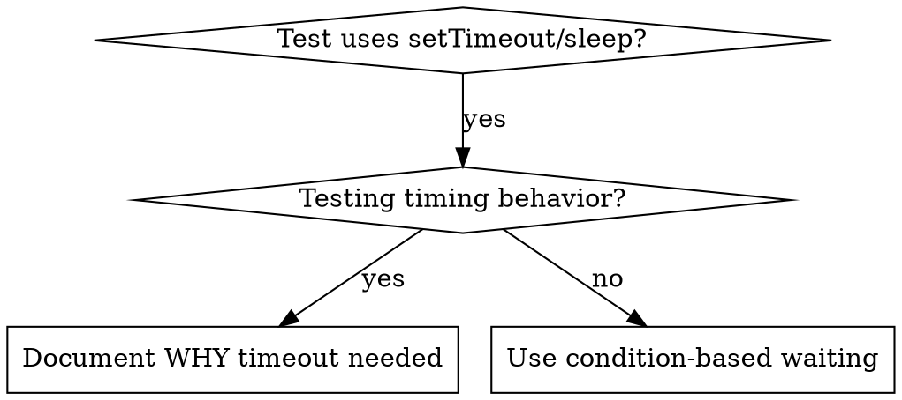

# 基于条件的等待

## 概述

不稳定的测试往往依赖任意延时来猜测时机。这会引发竞态条件，导致测试在本地快速机器上通过，却在高负载或 CI 环境下失败。

**核心原则：** 等待你真正关心的条件满足，而不是猜测它需要多长时间。

## 适用场景



**适用于：**
- 测试中存在任意延时（`setTimeout`、`sleep`、`time.sleep()`）
- 测试表现不稳定（时而通过，在高负载下时而失败）
- 测试在并行运行时超时
- 等待异步操作完成

**不适用于：**
- 测试真正的时序行为（防抖、节流间隔等）
- 若使用任意延时，务必注释说明原因

## 核心模式

```typescript
// ❌ 修改前：猜测时机
await new Promise(r => setTimeout(r, 50));
const result = getResult();
expect(result).toBeDefined();

// ✅ 修改后：等待条件满足
await waitFor(() => getResult() !== undefined);
const result = getResult();
expect(result).toBeDefined();
```

## 常用模式

| 场景 | 模式 |
|----------|---------|
| 等待事件 | `waitFor(() => events.find(e => e.type === 'DONE'))` |
| 等待状态 | `waitFor(() => machine.state === 'ready')` |
| 等待数量 | `waitFor(() => items.length >= 5)` |
| 等待文件 | `waitFor(() => fs.existsSync(path))` |
| 复杂条件 | `waitFor(() => obj.ready && obj.value > 10)` |

## 实现

通用轮询函数：

```typescript
async function waitFor<T>(
  condition: () => T | undefined | null | false,
  description: string,
  timeoutMs = 5000
): Promise<T> {
  const startTime = Date.now();

  while (true) {
    const result = condition();
    if (result) return result;

    if (Date.now() - startTime > timeoutMs) {
      throw new Error(`Timeout waiting for ${description} after ${timeoutMs}ms`);
    }

    await new Promise(r => setTimeout(r, 10)); // Poll every 10ms
  }
}
```

完整实现及领域专用辅助函数（`waitForEvent`、`waitForEventCount`、`waitForEventMatch`）请参阅本目录下的 `condition-based-waiting-example.ts`，均来自真实调试过程。

## 常见错误

**❌ 轮询过快：** `setTimeout(check, 1)` - 浪费 CPU
**✅ 修正：** 每 10ms 轮询一次

**❌ 无超时：** 条件始终不满足时会无限循环
**✅ 修正：** 始终设置超时，并给出清晰的错误信息

**❌ 数据过期：** 在循环前缓存状态
**✅ 修正：** 在循环内调用 getter 获取最新数据

## 何时应该使用任意延时

```typescript
// 工具每 100ms 触发一次 — 需要 2 次触发来验证部分输出
await waitForEvent(manager, 'TOOL_STARTED'); // 第一步：等待条件满足
await new Promise(r => setTimeout(r, 200));   // 第二步：等待时序行为
// 200ms = 按 100ms 间隔计算的 2 次触发 — 已说明理由并加注注释
```

**要求：**
1. 先等待触发条件满足
2. 基于已知的时序（而非猜测）
3. 注释说明原因

## 实际效果

来自调试实践（2025-10-03）：
- 横跨 3 个文件修复了 15 个不稳定测试
- 通过率：60% → 100%
- 执行时间：快 40%
- 彻底消除竞态条件
