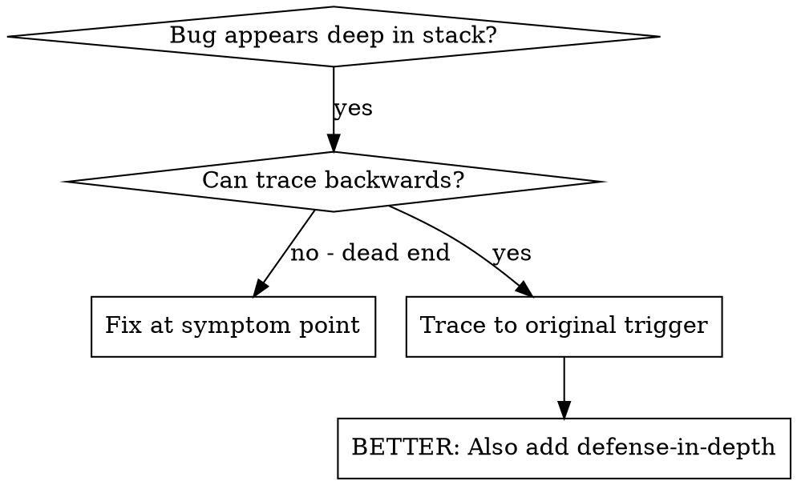
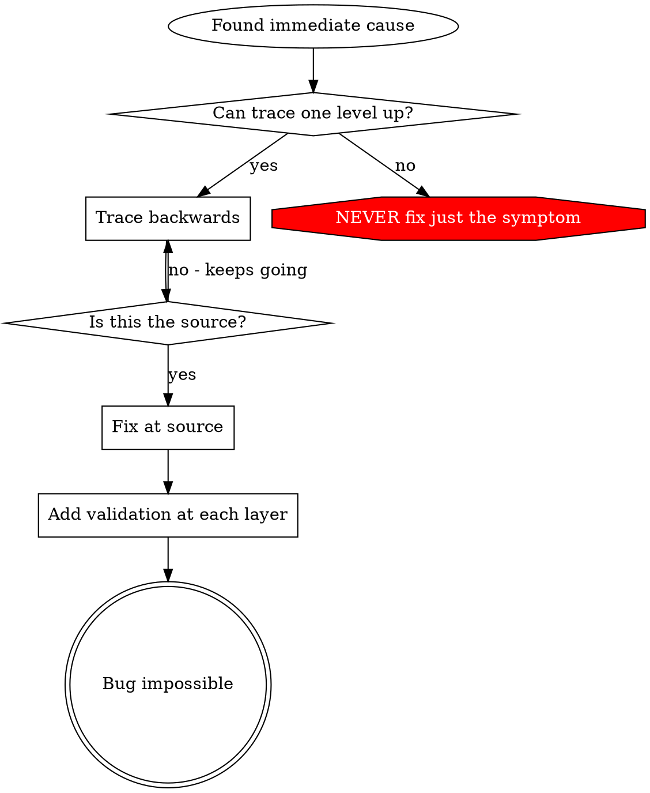

# 根因追溯

## 概述

缺陷往往在调用栈深处才显现（例如 git init 执行在了错误目录、文件创建到了错误位置、数据库使用了错误的路径打开）。直觉会让你在报错出现的地方修复，但那只是在处理表象。

**核心原则：** 沿调用链逆向追溯，直到找到最初的触发点，然后在源头修复。

## 适用场景



**适用于：**
- 错误发生在执行链路深处（而非入口处）
- 堆栈信息显示调用链很长
- 不清楚非法数据的来源
- 需要定位是哪段测试/代码触发了问题

## 追溯过程

### 1. 观察表象
```
Error: git init failed in ~/project/packages/core
```

### 2. 定位直接原因
**哪段代码直接导致了该问题？**
```typescript
await execFileAsync('git', ['init'], { cwd: projectDir });
```

### 3. 追问：是谁调用了它？
```typescript
WorktreeManager.createSessionWorktree(projectDir, sessionId)
  → called by Session.initializeWorkspace()
  → called by Session.create()
  → called by test at Project.create()
```

### 4. 继续向上追溯
**传入了什么值？**
- `projectDir = ''`（空字符串！）
- 空字符串作为 `cwd` 会被解析为 `process.cwd()`
- 此时指向的正是源码目录！

### 5. 找到最初触发点
**空字符串从何而来？**
```typescript
const context = setupCoreTest(); // Returns { tempDir: '' }
Project.create('name', context.tempDir); // Accessed before beforeEach!
```

## 添加堆栈追踪

当无法手动追溯时，添加插桩：

```typescript
// Before the problematic operation
async function gitInit(directory: string) {
  const stack = new Error().stack;
  console.error('DEBUG git init:', {
    directory,
    cwd: process.cwd(),
    nodeEnv: process.env.NODE_ENV,
    stack,
  });

  await execFileAsync('git', ['init'], { cwd: directory });
}
```

**关键：** 在测试中使用 `console.error()`（不要用 logger——可能不会输出）

**运行并捕获：**
```bash
npm test 2>&1 | grep 'DEBUG git init'
```

**分析堆栈：**
- 查找测试文件名
- 定位触发调用的行号
- 识别规律（是否是同一个测试？同一个参数？）

## 定位哪个测试造成了污染

如果某现象在测试过程中出现，但不清楚是哪个测试导致的：

使用本目录下的二分脚本 `find-polluter.sh`：

```bash
./find-polluter.sh '.git' 'src/**/*.test.ts'
```

逐个运行测试，遇到首个污染者即停止。用法见脚本说明。

## 真实案例：空的 projectDir

**表象：** `.git` 被创建在了 `packages/core/`（源码目录）下

**追溯链路：**
1. `git init` 运行在 `process.cwd()` ← 空的 cwd 参数
2. WorktreeManager 被传入了空的 projectDir
3. Session.create() 传入了空字符串
4. 测试在 beforeEach 之前就访问了 `context.tempDir`
5. setupCoreTest() 初始返回 `{ tempDir: '' }`

**根因：** 顶层变量初始化时访问了空值

**修复：** 将 tempDir 改为 getter，在 beforeEach 之前访问时直接抛出异常

**同时增加了纵深防御：**
- 第 1 层：Project.create() 校验目录
- 第 2 层：WorkspaceManager 校验非空
- 第 3 层：NODE_ENV 保护，拒绝在 tmpdir 之外执行 git init
- 第 4 层：在 git init 前记录堆栈日志

## 关键原则



**永远不要只在报错处修复。** 逆向追溯，找到最初的触发点。

## 堆栈追踪技巧

**在测试中：** 使用 `console.error()` 而非 logger——logger 可能被屏蔽
**在操作前：** 危险操作执行前就打日志，而不是等失败后再打
**包含上下文：** 目录、cwd、环境变量、时间戳
**捕获堆栈：** `new Error().stack` 可展示完整调用链

## 实际效果

来自一次调试实录（2025-10-03）：
- 通过 5 层追溯找到根因
- 在源头修复（getter 校验）
- 增加 4 层防御
- 1847 项测试通过，零污染
