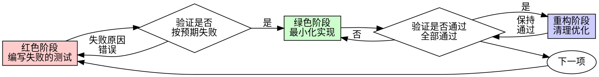

# 测试驱动开发（TDD）

## 概述

先写测试。观察它失败。再写最少的代码让它通过。

**核心原则：** 如果你没有亲眼看到测试失败，你就无法确定它是否真的测对了东西。

**违反规则的字面要求，就是违背规则的精神。**

## 何时使用

**始终使用：**
- 新功能
- 缺陷修复
- 重构
- 行为变更

**例外情况（需征得协作人同意）：**
- 一次性原型
- 生成的代码
- 配置文件

想着“就这一次跳过 TDD”？打住，这就是在自我合理化。

## 铁律

```
NO PRODUCTION CODE WITHOUT A FAILING TEST FIRST
```

没有先写出一个失败的测试，就不写任何生产代码。

在测试之前写了代码？删掉，重来。

**没有例外：**
- 不要留着当“参考”
- 不要在写测试时“改造”它
- 不要去看它
- 删除就是删除

完全基于测试重新实现，没有例外。

## 红-绿-重构



### 红色阶段 - 编写失败的测试

写一个最小化的测试，展示应该发生什么。

<Good>
```typescript
test('retries failed operations 3 times', async () => {
  let attempts = 0;
  const operation = () => {
    attempts++;
    if (attempts < 3) throw new Error('fail');
    return 'success';
  };

  const result = await retryOperation(operation);

  expect(result).toBe('success');
  expect(attempts).toBe(3);
});
```
命名清晰、测试真实行为、只测一件事
</Good>

<Bad>
```typescript
test('retry works', async () => {
  const mock = jest.fn()
    .mockRejectedValueOnce(new Error())
    .mockRejectedValueOnce(new Error())
    .mockResolvedValueOnce('success');
  await retryOperation(mock);
  expect(mock).toHaveBeenCalledTimes(3);
});
```
命名模糊、测的是 mock 而非真实代码
</Bad>

**要求：**
- 一次只测一个行为
- 命名清晰
- 使用真实代码（除非不得不 mock）

### 验证红色阶段 - 观察失败

**强制要求，切勿跳过。**

```bash
npm test path/to/test.test.ts
```

确认：
- 测试失败（而非报错）
- 失败信息符合预期
- 失败原因是功能缺失导致（而非拼写错误）

**测试通过了？** 说明你在测试已有的行为，请修正测试。

**测试报错了？** 修复错误，直到它以正确的方式失败为止。

### 绿色阶段 - 最小化实现

编写刚好能让测试通过的最简代码。

<Good>
```typescript
async function retryOperation<T>(fn: () => Promise<T>): Promise<T> {
  for (let i = 0; i < 3; i++) {
    try {
      return await fn();
    } catch (e) {
      if (i === 2) throw e;
    }
  }
  throw new Error('unreachable');
}
```
刚好够通过
</Good>

<Bad>
```typescript
async function retryOperation<T>(
  fn: () => Promise<T>,
  options?: {
    maxRetries?: number;
    backoff?: 'linear' | 'exponential';
    onRetry?: (attempt: number) => void;
  }
): Promise<T> {
  // YAGNI
}
```
过度设计
</Bad>

不要添加测试未要求的功能，不要顺手重构其他代码，也不要做超出测试范围的“优化”。

### 验证绿色阶段 - 观察通过

**强制要求。**

```bash
npm test path/to/test.test.ts
```

确认：
- 测试通过
- 其他测试仍全部通过
- 输出干净（无错误、无警告）

**测试失败？** 修代码，而不是改测试。

**其他测试失败？** 立即修复。

### 重构阶段 - 清理优化

仅在变绿之后：
- 消除重复
- 改进命名
- 抽取辅助函数

保持测试持续通过，不要新增行为。

### 重复

为下一个功能编写下一个失败的测试。

## 好的测试

| 质量 | 好的示例 | 差的示例 |
|---------|------|-----|
| **最小化** | 只测一件事，名称里出现“和”就拆分 | `test('validates email and domain and whitespace')` |
| **清晰** | 名称描述行为 | `test('test1')` |
| **体现意图** | 展示期望的 API 用法 | 掩盖代码应有的行为 |

在编写或修改任何测试时，请阅读 [writing-good-tests.md](writing-good-tests.md) 中让测试保持诚实的规则：
- 在编写测试前，先说清楚什么样的生产代码变更会让它失败
- 只对真实行为做断言，绝不对 mock 的行为做断言
- 仅用于测试的代码放在测试工具中，不要放进生产类
- 只有在理解依赖的副作用后，才去 mock 它

## 常见的自我合理化

| 借口 | 实际情况 |
|--------|---------|
| "太简单了，不用测" | 简单的代码也会出错，写个测试只要 30 秒。 |
| "先实现，之后再补测试" | 后补的测试会立刻通过——这什么也证明不了。它们可能测错了东西、测的是实现而非行为，或遗漏了你忘记的边界情况。你从未看过它失败，也就从未证明它能捕获缺陷。测试先行才会迫使失败发生。 |
| "后补测试也能达到同样的目标（重精神不重形式）" | 后补测试回答的是“这段代码做了什么？”；先行测试回答的是“这段代码应该做什么？”。后补的测试受你已写代码的影响——你只会验证自己记得的场景，而非本应发现的场景。没有经过失败验证的覆盖率毫无说服力。 |
| "已经手动测过了" | 手动测试是随意的：没有覆盖记录、代码变更后无法重复执行、压力下容易遗漏场景。“我试的时候是好的”不等于全面。自动化测试每次都以同样的方式运行。 |
| "删掉花了 X 小时的代码太浪费了" | 沉没成本谬误——时间已经花掉了，无法挽回。真正的选择是：用 TDD 重写（高可信度） vs. 保留现有代码再后补测试（低可信度、很可能有缺陷）。保留不可信的代码才是浪费。 |
| "留着当参考，先写测试" | 你会忍不住去适配它，这本质还是后补测试。删除就是删除。 |
| "需要先探索一下" | 可以，先探索，探索完扔掉，再从 TDD 开始。 |
| "测试很难写 = 设计不清晰" | 听测试的，难测就意味着难用。 |
| "TDD 会拖慢我" | TDD 才是务实的路径：在提交前捕获缺陷、防止回归、让你无惧重构。所谓“务实”的捷径只会把调试推到线上——更慢，而非更快。 |
| "手动测试更快" | 手动测试无法证明边界情况，每次变更你都要重新测一遍。 |
| "现有代码本来就没测试" | 你正在改进它，给现有代码补上测试。 |

## 危险信号 - 立即停下并重来

- 先写代码，后写测试
- 在实现之后才补测试
- 测试立刻通过
- 无法解释测试为何失败
- 测试“稍后”再补
- 为“就这一次”找合理化理由
- “我已经手动测过了”
- “后补测试也能达到同样目的”
- “重在精神，不在形式”
- “留着当参考”或“在现有代码上改一改”
- “已经花了 X 小时，删掉太浪费”
- “TDD 太教条，我这是务实”
- “这次情况特殊，因为……”

**出现以上任何一种，意味着：删掉代码，用 TDD 重来。**

## 示例：缺陷修复

**缺陷：** 空邮箱被接受

**红色阶段**
```typescript
test('rejects empty email', async () => {
  const result = await submitForm({ email: '' });
  expect(result.error).toBe('Email required');
});
```

**验证红色阶段**
```bash
$ npm test
FAIL: expected 'Email required', got undefined
```

**绿色阶段**
```typescript
function submitForm(data: FormData) {
  if (!data.email?.trim()) {
    return { error: 'Email required' };
  }
  // ...
}
```

**验证绿色阶段**
```bash
$ npm test
PASS
```

**重构阶段**
如有需要，为多个字段抽取统一的校验逻辑。

## 验证清单

标记完成前请逐项检查：

- [ ] 每个新增的函数/方法都有对应的测试
- [ ] 已亲眼看到每个测试在实现前失败
- [ ] 每个测试都以预期的原因失败（功能缺失，而非拼写错误）
- [ ] 仅编写了刚好让测试通过的最简代码
- [ ] 所有测试均已通过
- [ ] 输出干净（无错误、无警告）
- [ ] 测试使用真实代码（仅在不得已时使用 mock）
- [ ] 已覆盖边界情况和错误路径

无法全部勾选？你跳过了 TDD，请重来。

## 遇到阻塞时

| 问题 | 解决方案 |
|---------|----------|
| 不知道怎么测 | 写出你期望的 API，先写断言，找协作人讨论。 |
| 测试太复杂 | 设计太复杂，简化接口。 |
| 必须 mock 所有东西 | 代码耦合过重，使用依赖注入。 |
| 测试准备工作过于庞大 | 抽取辅助函数，依然复杂？简化设计。 |

## 调试集成

发现缺陷？先写一个能复现它的失败测试，再走 TDD 循环。测试既能证明修复有效，也能防止回归。

绝不在没有测试的情况下修复缺陷。

## 最终规则

```
生产代码 → 已存在对应测试且该测试曾先失败
否则 → 就不是 TDD
```

未经协作人许可，没有例外。
