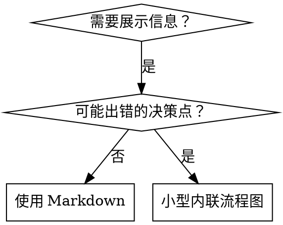

# 技能编写

## 概览

**编写技能就是将测试驱动开发应用于流程文档。**

**个人技能存放于运行时的技能目录**（Claude Code 上为 `~/.claude/skills/`）—— 其他运行时的路径请参见 [codex-tools.md](../using-superpowers/references/codex-tools.md) 或 [gemini-tools.md](../using-superpowers/references/gemini-tools.md)。Codex、Copilot CLI 和 Gemini CLI 也都将 `~/.agents/skills/` 识别为跨运行时别名。

你编写测试用例（带子智能体的压力场景）、观察其失败（基线行为）、编写技能（文档）、观察测试通过（智能体已遵守）、再进行重构（堵住漏洞）。

**核心原则：** 如果你没有亲眼看到智能体在没有技能的情况下失败，你就无法判断技能是否真正教会了正确的内容。

**必备前置知识：** 使用本技能前，你必须理解 superpowers:test-driven-development。该技能定义了基本的 红-绿-重构 循环，本技能则是将 TDD 适配到文档编写上。

**官方指引：** 关于 Anthropic 官方的技能编写最佳实践，请参见 anthropic-best-practices.md。本文档在以 TDD 为核心的方法之外，提供了额外的模式与指南作为补充。

## 什么是技能？

**技能**是用于已被验证有效的技巧、模式或工具的参考指南。技能帮助未来的智能体快速找到并应用高效方法。

**技能是：** 可复用的技巧、模式、工具、参考指南

**技能不是：** 对某次问题解决过程的叙事记录

## TDD 与技能编写的映射

| TDD 概念 | 技能创建 |
|-------------|----------------|
| **测试用例** | 带子智能体的压力场景 |
| **生产代码** | 技能文档（SKILL.md） |
| **测试失败（红）** | 智能体在无技能情况下违反规则（基线） |
| **测试通过（绿）** | 智能体在有技能情况下遵守规则 |
| **重构** | 在保持合规的前提下堵住漏洞 |
| **先写测试** | 在编写技能之前先运行基线场景 |
| **观察失败** | 记录智能体使用的确切辩解话术 |
| **最小化代码** | 编写针对性解决上述违规行为的技能 |
| **观察通过** | 验证智能体现在已遵守规则 |
| **重构循环** | 发现新的辩解话术 → 堵住 → 重新验证 |

整个技能创建过程遵循 红-绿-重构 循环。

## 何时创建技能

**满足以下情况时创建：**
- 该技巧对你而言并非直观可见
- 你会在多个项目中反复查阅它
- 该模式具有普适性（非项目特有）
- 他人也能从中受益

**以下情况不要创建：**
- 一次性的解决方案
- 已在别处有完善文档的标准实践
- 项目特定的约定（应放在你的 instructions 文件中）
- 可机械化约束的内容（如果能用正则/校验强制执行，就自动化处理——文档应留给需要判断的场景）

## 技能类型

### 技巧型（Technique）
具有明确执行步骤的具体方法（condition-based-waiting、root-cause-tracing）

### 模式型（Pattern）
思考问题的方式（flatten-with-flags、test-invariants）

### 参考型（Reference）
API 文档、语法指南、工具说明（office docs）

## 目录结构


```
skills/
  skill-name/
    SKILL.md              # 主文档（必需）
    supporting-file.*     # 仅在需要时添加
```

**扁平命名空间** - 所有技能处于同一个可搜索的命名空间

**以下情况需拆分为独立文件：**
1. **重量级参考**（100 行以上）- API 文档、完整语法说明
2. **可复用工具** - 脚本、实用程序、模板

**保持内联的情况：**
- 原则与概念
- 代码模式（< 50 行）
- 其他所有内容

## SKILL.md 结构

**Frontmatter（YAML）：**
- 两个必填字段：`name` 和 `description`（所有支持的字段见 [agentskills.io/specification](https://agentskills.io/specification)）
- 总计不超过 1024 字符
- `name`：仅使用字母、数字和连字符（不要包含括号、特殊字符）
- `description`：使用第三人称，仅描述何时使用（而非技能做了什么）
  - 以 "Use when..." 开头，聚焦触发条件
  - 包含具体的症状、场景和上下文
  - **切勿概括技能的流程或工作流**（原因见 SDO 一节）
  - 尽量控制在 500 字符以内

```markdown
---
name: Skill-Name-With-Hyphens
description: Use when [具体的触发条件与症状]
---

# 技能名称

## 概览
这是什么？用 1-2 句话说明核心原则。

## 何时使用
[如果判断逻辑不直观，则加入小型内联流程图]

带症状和使用场景的要点列表
何时不使用

## 核心模式（适用于技巧/模式类）
修改前后的代码对比

## 快速参考
用于快速查阅的表格或要点列表

## 实现
简单模式直接内联代码
重量级参考或可复用工具则链接到独立文件

## 常见错误
哪里会出错 + 修复方法

## 实际影响（可选）
具体成果
```


## 技能发现优化（SDO）

**对发现至关重要：** 未来的智能体需要能够找到你的技能

### 1. 丰富的 Description 字段

**目的：** 你的智能体会读取 description 来判断当前任务是否需要加载某个技能。要让它能回答："我现在该读这个技能吗？"

**格式：** 以 "Use when..." 开头，聚焦触发条件

**关键：Description = 何时使用，而非技能做了什么**

description 应仅描述触发条件，不要概括技能的流程或工作流。

**为什么这很重要：** 测试发现，当 description 概括了技能的工作流时，智能体可能会直接沿用 description 的描述，而不再阅读完整的技能内容。一个写着 "code review between tasks" 的 description 曾导致智能体只做了一次审查，尽管技能中的流程图明确展示了两次审查（先合规性审查，再代码质量审查）。

当 description 被改为仅保留 "Use when executing implementation plans with independent tasks"（不含工作流概括）后，智能体才正确读取了流程图，并执行了两阶段审查流程。

**陷阱：** 概括工作流的 description 会成为智能体走捷径的入口，技能正文反而被跳过。

```yaml
# ❌ 错误：概括了工作流——智能体可能直接照做而不读技能正文
description: Use when executing plans - dispatches subagent per task with code review between tasks

# ❌ 错误：过多流程细节
description: Use for TDD - write test first, watch it fail, write minimal code, refactor

# ✅ 正确：仅包含触发条件，不概括工作流
description: Use when executing implementation plans with independent tasks in the current session

# ✅ 正确：仅包含触发条件
description: Use when implementing any feature or bugfix, before writing implementation code
```

**内容要求：**
- 使用具体的触发词、症状和场景来表明技能的适用条件
- 描述问题本身（竞态条件、行为不一致）而非特定语言的表象（setTimeout、sleep）
- 保持触发条件技术无关，除非技能本身就是面向特定技术的
- 如果技能面向特定技术，需在触发条件中明确说明
- 使用第三人称（会被注入到系统提示中）
- **切勿概括技能的流程或工作流**

```yaml
# ❌ 错误：过于抽象、模糊，未说明何时使用
description: For async testing

# ❌ 错误：第一人称
description: I can help you with async tests when they're flaky

# ❌ 错误：提到了技术，但技能本身并不面向该技术
description: Use when tests use setTimeout/sleep and are flaky

# ✅ 正确：以 "Use when" 开头，描述问题，不含工作流
description: Use when tests have race conditions, timing dependencies, or pass/fail inconsistently

# ✅ 正确：面向特定技术的技能，触发条件明确
description: Use when using React Router and handling authentication redirects
```

### 2. 关键词覆盖

使用智能体会搜索的词语：
- 错误信息："Hook timed out"、"ENOTEMPTY"、"race condition"
- 症状："flaky"、"hanging"、"zombie"、"pollution"
- 同义词："timeout/hang/freeze"、"cleanup/teardown/afterEach"
- 工具：实际的命令、库名、文件类型

### 3. 描述性命名

**使用主动语态、动词优先：**
- ✅ `creating-skills` 而非 `skill-creation`
- ✅ `condition-based-waiting` 而非 `async-test-helpers`

### 4. Token 效率（关键）

**问题：** getting-started 和高频引用的技能会在每次对话中都被加载，每一个 token 都很重要。

**目标字数：**
- getting-started 类工作流：每个 <150 词
- 高频加载的技能：总计 <200 词
- 其他技能：<500 词（仍需保持简洁）

**技巧：**

**将细节移至工具帮助中：**
```bash
# ❌ 错误：在 SKILL.md 中罗列所有参数
search-conversations supports --text, --both, --after DATE, --before DATE, --limit N

# ✅ 正确：引用 --help
search-conversations 支持多种模式和过滤条件。运行 --help 查看详情。
```

**使用交叉引用：**
```markdown
# ❌ 错误：重复工作流细节
When searching, dispatch subagent with template...
[20 行重复说明]

# ✅ 正确：引用其他技能
始终使用子智能体（可节省 50-100 倍上下文）。必需：工作流请使用 [other-skill-name]。
```

**压缩示例：**
```markdown
# ❌ 错误：冗长示例（42 词）
your human partner: "How did we handle authentication errors in React Router before?"
You: I'll search past conversations for React Router authentication patterns.
[Dispatch subagent with search query: "React Router authentication error handling 401"]

# ✅ 正确：精简示例（20 词）
Partner: "How did we handle auth errors in React Router?"
You: Searching...
[Dispatch subagent → synthesis]
```

**消除冗余：**
- 不要重复交叉引用技能中已有的内容
- 不要解释从命令本身就能看出含义的内容
- 不要为同一模式提供多个示例

**验证：**
```bash
wc -w skills/path/SKILL.md
# getting-started 工作流：目标 <150 词/个
# 其他高频加载：目标总计 <200 词
```

**按功能或核心洞察命名：**
- ✅ `condition-based-waiting` > `async-test-helpers`
- ✅ `using-skills` 而非 `skill-usage`
- ✅ `flatten-with-flags` > `data-structure-refactoring`
- ✅ `root-cause-tracing` > `debugging-techniques`

**动名词（-ing）适合描述过程：**
- `creating-skills`、`testing-skills`、`debugging-with-logs`
- 主动语态，描述你正在执行的动作

### 5. 交叉引用其他技能

**在编写引用其他技能的文档时：**

仅使用技能名称，并加上明确的必要性标记：
- ✅ 正确：`**REQUIRED SUB-SKILL:** Use superpowers:test-driven-development`
- ✅ 正确：`**REQUIRED BACKGROUND:** You MUST understand superpowers:systematic-debugging`
- ❌ 错误：`See skills/testing/test-driven-development`（是否必需不明确）
- ❌ 错误：`@skills/testing/test-driven-development/SKILL.md`（会强制加载，浪费上下文）

**为什么不要使用 @ 链接：** `@` 语法会立即强制加载文件，在你真正需要之前就消耗掉 20 万以上的上下文。

## 流程图使用



**仅在以下情况使用流程图：**
- 不直观的决策点
- 可能过早结束的流程循环
- "何时使用 A 还是 B" 的判断

**切勿在以下情况使用流程图：**
- 参考材料 → 使用表格、列表
- 代码示例 → 使用 Markdown 代码块
- 线性步骤说明 → 使用有序列表
- 无语义的标签（step1、helper2）

风格规则见本目录下的 `graphviz-conventions.dot`。

**为你的真人协作者可视化：** 使用本目录下的 `render-graphs.js` 将技能中的流程图渲染为 SVG：
```bash
./render-graphs.js ../some-skill           # 逐个单独渲染
./render-graphs.js ../some-skill --combine # 合并到一个 SVG 中
```

## 代码示例

**一个优秀的示例胜过多个平庸的示例**

选择最相关的语言：
- 测试技巧 → TypeScript/JavaScript
- 系统调试 → Shell/Python
- 数据处理 → Python

**好的示例：**
- 完整且可运行
- 注释充分，并解释原因
- 来自真实场景
- 清晰展示模式
- 易于改编（而非通用模板）

**不要：**
- 用 5 种以上语言实现
- 制作填空式模板
- 编写刻意的示例

你擅长移植——一个高质量示例就足够了。

## 文件组织

### 自包含技能
```
defense-in-depth/
  SKILL.md    # 所有内容内联
```
适用场景：所有内容都能容纳，无需重量级参考

### 带可复用工具的技能
```
condition-based-waiting/
  SKILL.md    # 概览 + 模式
  example.ts  # 可直接改编的可用辅助函数
```
适用场景：工具是可复用的代码，而不仅仅是叙述

### 带重量级参考的技能
```
pptx/
  SKILL.md       # 概览 + 工作流
  pptxgenjs.md   # 600 行 API 参考
  ooxml.md       # 500 行 XML 结构
  scripts/       # 可执行工具
```
适用场景：参考材料篇幅过大，不适合内联

## 铁律（与 TDD 相同）

```
NO SKILL WITHOUT A FAILING TEST FIRST
```

这适用于新建技能和对现有技能的编辑。

在测试之前编写技能？删掉，重来。
未测试就编辑技能？同样违规。

**没有例外：**
- 不能因为"只是简单补充"就例外
- 不能因为"只是加一节"就例外
- 不能因为"只是文档更新"就例外
- 不要将未经测试的改动当作"参考"保留
- 测试运行时不要"边测边改"
- 删除就是删除

**必备前置知识：** superpowers:test-driven-development 技能解释了为何这很重要，同样的原则也适用于文档。

## 测试所有技能类型

不同类型的技能需要不同的测试方法：

### 纪律约束型技能（规则/要求）

**示例：** TDD、完成前验证、编码前设计

**测试方式：**
- 学术性提问：是否理解规则？
- 压力场景：高压下是否仍遵守？
- 多重压力叠加：时间 + 沉没成本 + 疲惫
- 识别辩解话术并添加明确反制

**成功标准：** 智能体在最大压力下仍遵守规则

### 技巧型技能（操作指南）

**示例：** condition-based-waiting、root-cause-tracing、defensive-programming

**测试方式：**
- 应用场景：能否正确应用该技巧？
- 变体场景：能否处理边界情况？
- 信息缺失测试：说明中是否存在 gaps？

**成功标准：** 智能体能将技巧成功应用于新场景

### 模式型技能（心智模型）

**示例：** reducing-complexity、information-hiding 相关概念

**测试方式：**
- 识别场景：能否识别模式的适用时机？
- 应用场景：能否运用该心智模型？
- 反例：是否知道何时不应使用？

**成功标准：** 智能体能正确判断何时/如何应用该模式

### 参考型技能（文档/API）

**示例：** API 文档、命令参考、库指南

**测试方式：**
- 检索场景：能否找到正确信息？
- 应用场景：能否正确使用检索到的信息？
- Gap 测试：常见用例是否已覆盖？

**成功标准：** 智能体能找到并正确应用参考信息

## 跳过测试的常见借口

| 借口 | 现实 |
|--------|---------|
| "技能已经足够清晰" | 对你清晰 ≠ 对其他智能体清晰，必须测试。 |
| "这只是个参考" | 参考也可能存在缺口、表述不清，需要测试检索效果。 |
| "测试太小题大做" | 未经测试的技能一定有问题，15 分钟测试能节省数小时。 |
| "有问题再测" | 问题 = 智能体无法使用该技能，部署前就必须测试。 |
| "测试太繁琐" | 测试的繁琐程度远低于在生产环境调试有缺陷技能的痛苦。 |
| "我很有把握没问题" | 过度自信必然导致问题，仍需测试。 |
| "学术性审查就够了" | 阅读 ≠ 会用，必须测试应用场景。 |
| "没时间测试" | 部署未经测试的技能，后续修复会浪费更多时间。 |

**以上所有情况都意味着：部署前必须测试，没有例外。**

## 让形式匹配失效类型

在编写指引前，先对基线失效进行分类。针对一种失效类型有效的形式，用在另一种类型上会明显适得其反。

| 基线失效 | 正确形式 | 错误形式 |
|---|---|---|
| 在压力下跳过/违反规则（明知故犯） | 禁止项 + 辩解对照表 + 危险信号（见下文加固方法） | 软性指引（"尽量..."、"考虑..."） |
| 遵守了，但输出形态错误（提示词臃肿、结论被淹没、复述需求） | 正向配方或契约：明确输出是什么——包含哪些部分、按什么顺序 | 禁止清单（"不要复述"、"切勿叙述"） |
| 对已产出内容遗漏了必需元素 | 结构化：模板中设置必填字段或槽位 | 模板附近的文字提醒 |
| 行为应取决于某个条件 | 以可观察谓词为键的条件式（"如果简报存在，则引用它"） | 无条件规则 + 例外条款 |

**为什么禁止项在形态塑造问题上会适得其反：** 在竞争性动机（"让提示词自包含"）的影响下，智能体会与"不要做 X"进行博弈。在针对分发提示词指引的措辞对比测试中，禁止式措辞比配方式产生了明显更多的非期望内容，甚至比无指引的对照组表现更差——请对你自己的场景做微观测试而非想当然，但切勿默认使用禁止式。配方式无可博弈：输出要么符合既定形态，要么不符合。

**无论选择哪种形式，都需遵守以下规则：**
- **不要加细腻化条款。** "除非有必要否则不要做 X" 会重新打开博弈空间——在同一措辞测试中，给获胜配方追加一条细腻化条款，就使其从稳定表现退化为不稳定。真正的例外应表述为基于可观察谓词的独立条件式。
- **豁免条款不会自动限定范围。** "此限制不适用于代码块" 仍会抑制代码块的生成。如果部分输出必须豁免，应重构规则使其无法触及该部分。

## 加固技能以抵御辩解

需要强制执行纪律的技能（如 TDD）必须能抵御辩解。智能体很聪明，在压力下会找到漏洞。

**适用范围：** 本工具箱适用于纪律性失效——智能体明知规则却在压力下跳过。对于输出形态错误或要素遗漏问题，基于禁止的加固会适得其反；请改用上一节"让形式匹配失效类型"中的形式。

**心理学提示：** 理解说服技巧为何有效，有助于你系统化地运用它们。研究基础（Cialdini, 2021; Meincke et al., 2025）涵盖权威、承诺、稀缺、社会认同和统一性原则，详见 persuasion-principles.md。

### 明确堵住每一个漏洞

不要只陈述规则——要明确禁止具体的绕过方式：

<Bad>
```markdown
在写测试之前就写了代码？删掉。
```
</Bad>

<Good>
```markdown
在写测试之前就写了代码？删掉，重来。

**没有例外：**
- 不要将其保留为"参考"
- 不要在写测试时"改编"它
- 不要去看它
- 删除就是删除
```
</Good>

### 应对"精神 vs 文字" 的诡辩

在开头加入基础原则：

```markdown
**违反规则的字面含义，就是违反规则的精神。**
```

这能一次性堵住整类"我遵循的是精神"的辩解。

### 构建辩解对照表

捕获基线测试中的辩解话术（见下文测试一节）。智能体提出的每一个借口都要进入表格：

```markdown
| 借口 | 现实 |
|--------|---------|
| "太简单了不用测" | 简单的代码也会出错，测试只需 30 秒。 |
| "我之后会补测试" | 立即通过的测试毫无证明力。 |
| "后补测试也能达到同样目的" | 后补测试回答的是"它做了什么？"，先写测试回答的是"它应该做什么？" |
```

### 创建危险信号清单

让智能体易于自检是否正在为自己辩解：

```markdown
## 危险信号 - 立即停止并重来

- 在测试之前写了代码
- "我已经手动测试过了"
- "后补测试也能达到同样目的"
- "重在精神而非仪式"
- "这次情况特殊，因为..."

**以上所有情况都意味着：删除代码，从 TDD 重新开始。**
```

### 更新 SDO 以覆盖违规前兆

在 description 中加入即将违规时的症状：

```yaml
description: use when implementing any feature or bugfix, before writing implementation code
```

## 技能的 红-绿-重构

遵循 TDD 循环：

### 红：编写失败的测试（基线）

在不带技能的情况下用子智能体运行压力场景，记录确切行为：
- 它们做了什么选择？
- 使用了什么辩解话术（逐字记录）？
- 哪些压力触发了违规？

这就是"观察测试失败"——在编写技能之前，你必须看到智能体的自然行为。

### 绿：编写最小化技能

编写针对上述具体辩解的技能，不要为假想情况添加额外内容。

在带技能的情况下运行相同场景，智能体现在应能遵守规则。

### 重构：堵住漏洞

智能体找到了新的辩解？添加明确的反制措施，重新测试直至坚不可摧。

### 在完整场景之前先做措辞微观测试

完整的压力场景运行是最终关卡，但每次迭代都跑全量既慢又贵。在措辞层面先用微观测试验证：

1. **每次调用一个全新上下文样本**——一次原生 API 调用，或在无 API 访问时使用单次子智能体。系统提示 = 指引实际所处的真实上下文（完整的技能或提示模板，而非孤立的指引）；用户消息 = 会诱发失效的任务。
2. **始终包含无指引对照组。** 如果对照组没有出现失效，就说明没有需要修复的问题——立即停止，不要编写指引。
3. **每个变体至少 5 次重复。** 单次样本会误导。
4. **逐一人工复核每个被标记的命中。** 可以用程序化评分，但模板回声和引用的反例会被误判为命中；仅靠自动化计数会同时高估失败率和成功率。
5. **方差本身就是指标。** 当指引有效时，多次重复会收敛到同一种形态；五次重复出现五种不同解读，说明措辞不具备约束力——应先收紧形式，而非堆砌文字。

微观测试验证措辞，它们不能替代纪律型技能所需的压力场景测试。

**测试方法论：** 完整测试方法见 [testing-skills-with-subagents.md](testing-skills-with-subagents.md)：
- 如何编写压力场景
- 压力类型（时间、沉没成本、权威、疲惫）
- 系统化堵洞
- 元测试技术

## 反模式

### ❌ 叙事性示例
"In session 2025-10-03, we found empty projectDir caused..."
**为何不好：** 过于具体，不可复用

### ❌ 多语言稀释
example-js.js、example-py.py、example-go.go
**为何不好：** 质量平庸，维护负担重

### ❌ 在流程图中使用代码
```dot
step1 [label="import fs"];
step2 [label="read file"];
```
**为何不好：** 无法复制粘贴，难以阅读

### ❌ 通用标签
helper1、helper2、step3、pattern4
**为何不好：** 标签应具有语义含义

## 停止：在进入下一个技能之前

**编写完任何技能后，你必须停下来并完成部署流程。**

**不要：**
- 未逐个测试就批量创建多个技能
- 在当前技能验证完成前就进入下一个
- 以"批量更高效"为由跳过测试

**以下部署清单对每个技能都是强制性的。**

部署未经测试的技能 = 部署未经测试的代码，这违反了质量标准。

## 技能创建清单（TDD 适配版）

**重要：为下方每个清单项创建一个 todo。**

**红阶段 - 编写失败的测试：**
- [ ] 创建压力场景（纪律型技能需包含 3 种以上复合压力）
- [ ] 在无技能情况下运行场景——逐字记录基线行为
- [ ] 识别辩解话术/失败中的模式

**绿阶段 - 编写最小化技能：**
- [ ] 名称仅使用字母、数字、连字符（不含括号/特殊字符）
- [ ] YAML frontmatter 包含必填的 `name` 和 `description` 字段（总计不超过 1024 字符；见 [规范](https://agentskills.io/specification)）
- [ ] Description 以 "Use when..." 开头，并包含具体的触发条件/症状
- [ ] Description 使用第三人称
- [ ] 全文包含便于搜索的关键词（错误、症状、工具）
- [ ] 清晰的概览与核心原则
- [ ] 针对红阶段发现的具体基线失效进行处理
- [ ] 指引形式与失效类型匹配（见"让形式匹配失效类型"）
- [ ] 对于行为塑造类指引：措辞已通过微观测试验证（与无指引对照组对比，5 次以上重复，每个命中均人工复核）—— 纯参考型技能可标记为 N/A
- [ ] 代码内联或链接到独立文件
- [ ] 一个高质量示例（而非多语言示例）
- [ ] 在有技能情况下运行场景——验证智能体现在已遵守

**重构阶段 - 堵住漏洞：**
- [ ] 识别测试中出现的新辩解
- [ ] 添加明确反制（如果是纪律型技能）
- [ ] 基于所有测试轮次构建辩解对照表
- [ ] 创建危险信号清单
- [ ] 反复重测直至坚不可摧

**质量检查：**
- [ ] 仅在决策不直观时使用小型流程图
- [ ] 包含快速参考表格
- [ ] 包含常见错误一节
- [ ] 无叙事性讲述
- [ ] 仅在需要工具或重量级参考时才添加支撑文件

**部署：**
- [ ] 将技能提交到 git 并推送到你的 fork（如果已配置）
- [ ] 考虑通过 PR 回馈上游（如果具有普适价值）

## 发现工作流

未来智能体发现你技能的流程：

1. **遇到问题**（"测试不稳定"）
2. **搜索技能**（grep description、浏览分类）
3. **找到技能**（description 匹配）
4. **浏览概览**（判断是否相关？）
5. **阅读模式**（快速参考表）
6. **加载示例**（仅在实际实现时）

**针对此流程进行优化** - 将可搜索的关键词前置并高频出现。
